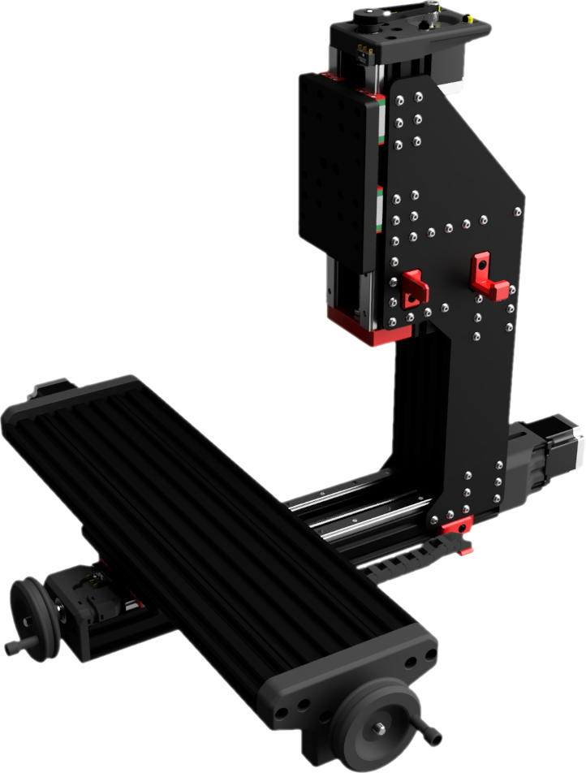
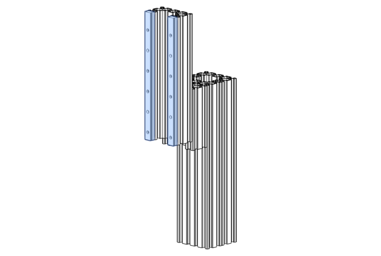
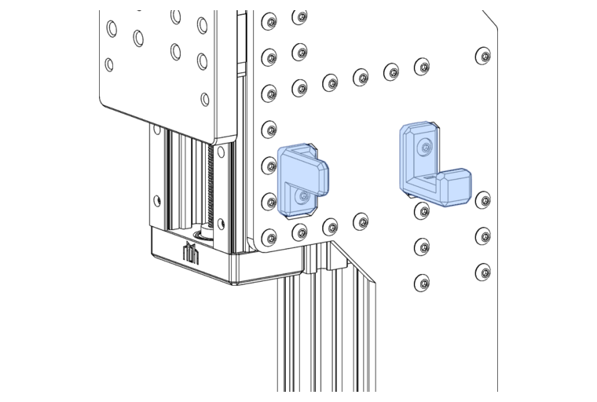

# FMJ Assembly



!!! note "FMJ"
    The Full Metal Jacket is an optional reinforcement for the Z-Axis that improves its' rigidity and strength significantly. If you're looking to cut metals, then you should think about installing the FMJ from the get-go.

!!! tip annotate "Standard Assembly"
    The following information applies _only_ if you are building your Milo with FMJ plates. If you do not have FMJ plates and are using 3D printed column joining plates, please follow [Installing the Column Plates](./z_axis_assembly.md#installing-the-column-plates) instead.

*[FMJ]: Full Metal Jacket

## FMJ Sourcing
FMJ's cannot be made on Milo due to their size - so you will need to acquire them by different means.

<!-- Check the [Sourcing Guide](../../bom/sourcing_guide.md) for FMJ kits. !-->

If self-sourcing, FMJ's should be laser-cut, ideally from Mild Steel, which will give you the best bang-for-your-buck.

FMJ's can be used to extend your Z clearance, which is the maximum work-piece and work-holding height that is able to move under the Z-column overhang. The stock clearance is 60mm, and with the maximum size FMJ this can be extended to 120mm.

If using the FMJ to extend your clearance, you will need to increase the length of the `A` and `B` extrusions (detailed in [Identifying Extrusions](#identifying-extrusions)) by the difference from the standard clearance. For 120mm clearance, you will need 320mm C-Beams (`120-60 + 260 = 320mm`).

The designs are available in the [User Mods Repository](https://github.com/MillenniumMachines/UserMods/tree/main/Millennium-Milo-V1.5-MODS/Techmorphic/Techmorphic-FMJ-para-plates) - the Fusion360 file is parametric, so you will need to check / set your parameters for length and bolt hole sizes before exporting for cutting.

Services like SendCutSend in the US or Fractory in the EU can produce FMJ's at a decent price, and they offer discounts for bulk runs.

Remember that a set of FMJ's contains _two_ plates, one for either side of the Z column.

If obtaining these plates with a non-durable surface finish (Mild Steel for example), then you will need to  paint the raw FMJ's to stop them corroding - we find sprayed truck-bed liner or appliance enamel provides a suitable coating durability, but feel free to experiment with other high-durability coatings.

---

## Identifying Extrusions

This section of the build contains a number of C-beams that are close together. To help you identify which parts are which, lay out your extrusions like the diagram shown below. The next steps will then highlight which extrusions are used for each step.

!!! info "Components Required"
    ```
    A: Openbuilds 4080x260mm C-Beam
    B: Openbuilds 4080x260mm C-Beam
    C: Openbuilds 4080x250mm C-Beam
    D: Openbuilds 4080x120mm C-Beam
    ```
{: .shadow}

---

Extrusions `A` and `B` are the main Z-column extrusions.

{: .shadow}

---

## Z-Axis Rail Assembly

!!! info annotate "Components Required"
    ```
    8 x M3x10mm SHCS
    2 x MGN15 Rail 250mm
    ```

Install the Z rails with only the lower carriages installed onto the `C` extrusion using M3x10mm SHCS.

Make sure the end-most and centre-most bolt holes in each rail are used.

Use printed [rail alignment guides](https://github.com/MillenniumMachines/Milo-v1.5/tree/main/STL%20Files/Tools/Rail%20Alignment%20Guide.stl) to make sure the rails are aligned.

{: .shadow}

!!! tip
    You can use the rail alignment guides to stop the lower carriages from falling off the vertical rail!

## Column Assembly

Place extrusions `A` and `B` facing each other, creating an internal channel. This is where the ballast box can be installed (later, calm down cowboy!).

Select extrusion `D`.

{: .shadow}

---

Place  extrusion `D` at the top of the column with the channel facing _outwards_ (away from extrusions `A` and `B`).

---

Select extrusion `C`.

{: .shadow}

---

Place extrusion `C` on the front of extrusion `D`, again with the channel (and rails!) facing _outwards_.

{: .shadow}

---

!!! tip
    The lower edge of extrusion `C` should be `18mm` above the lower edge of extrusion `D`, making room for the lower bearing block.

{: .shadow}

---

## FMJ Installation

!!! info annotate "Components Required"
    ```
    32 x M5x12mm BHCS
    2 x FMJ Plate (1)
    ```
1. :material-factory: See [FMJ Sourcing](#fmj-sourcing) above.

!!! warning
    If your FMJ plates are thicker than 6mm, you may need to use longer M5 BHCS to engage enough thread in the T-Nuts on the column. For example - if your FMJ is 8mm thick, you should use M5x14mm BHCS instead of 12mm.

Take one of your FMJ plates and line up the bottom edge of the FMJ shoulder with the bottom edge of the `C` extrusion.

{: .shadow}

---
{: .shadow}

---
Install all but the bottom 4 M5x12mm BHCS.

{: .shadow}

!!! warning "BE SAFE, LOCK IT!"
    These machines vibrate an immense amount when in use, and fasteners are bound to back out. Don't be afraid to add a little bit of medium-strength thread-lock to all your screws to avoid this problem.

!!! hint
    If using spring T-nuts for assembly, having a thin, long and semi-flexible tool to help guide the nuts into place is a godsend!

---

Turn your half-assembled column over and repeat with the other FMJ plate. Take care to line the second FMJ up with the first!

!!! hint
    Loosely bolt the second FMJ into place, then push the base of the FMJ's against a known-flat surface so that they are both flush.
    Tighten the second FMJ while in this position so that the plates stay aligned.

---

!!! note
    The cut-outs in the FMJ are for fitting cable hook and drag-chain mounts. This can be done now, or later when routing cabling and drag-chains.

{: .shadow}


[Next Chapter: Z-Axis Lower Bearing block](./z_axis_assembly.md#lower-bearing-block)