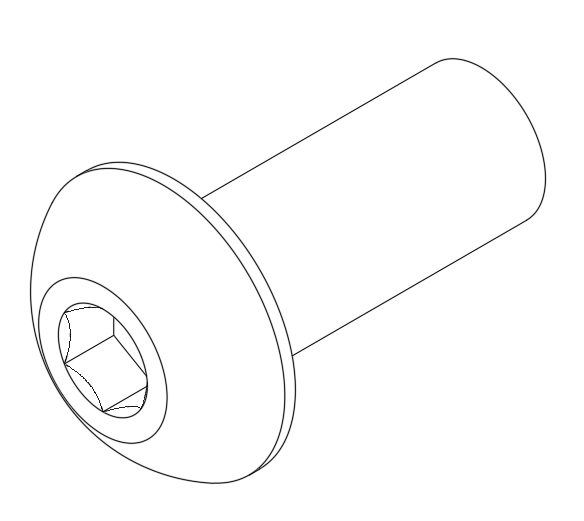
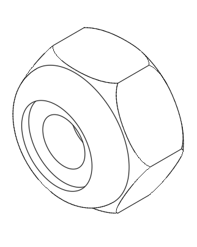
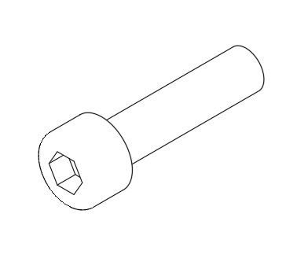
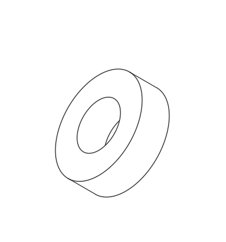
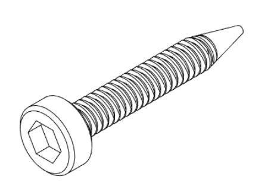
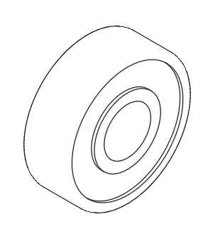
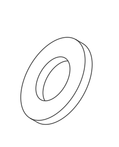
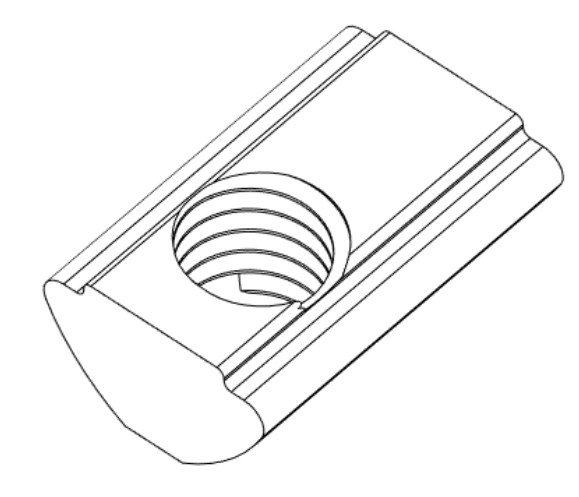
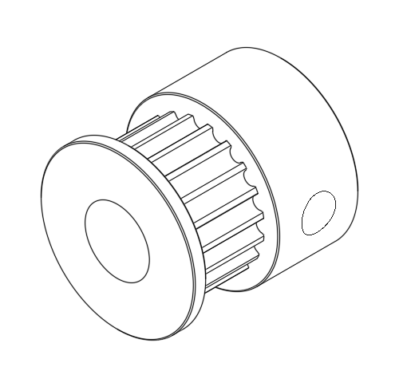

# Hardware reference

## Button head cap bolt (BHCS)

Metric fastener with a dome shaped head and hex drive. Most commonly found in locations where a fastener makes contact directly with a printed part.

ISO 7380-1

## Flat head countersunk bolt (FHCS)

Metric fastener with a dome shaped head and hex drive. Most commonly found in locations where a fastener makes contact directly with a printed part.

ISO 10642

## Nyloc hex nuts

Hex nuts couple with bolts to create a tight, secure joint. Nyloc nuts go one step further and cuddle your bolts like your mum used to when you were a child.

ISO 10642

## Socket head cap bolt (SHCS)

Metric fastener with a dome shaped head and hex drive. Most commonly found in locations where a fastener makes contact directly with either a metal part or in conjunction with a washer.

ISO 4762

## Fan screw CS-1

A PC standard fan mounting screw. Exclusively used to hold the system cooling fans to the bottom panel.

## Heat Set Insert

Heat inserts with a soldering tip so that they melt the plastic when installed. As the plastic cools, it solidifies around the knurls and ridges on the insert for excellent resistance to both torque and pull-out.

---

## F608ZZ bearing

A ball bearing with a flange used to hold leadscrews in place.

## Locking collar

Steel or aluminium loops with a grub screw in the side used to limit the free travel of a leadscrew.

## Self Tapping screw

Fastener with a pronounced thread profile that is bolted directly into plastic.

## 608ZZ bearing

A ball bearing used to hold leadscrews in place.

## Washer

Usually stamped from sheet metal this type of spacer distributes load over a larger area. Only used in M5 size.

## Set Screw

Small headless fastener with an internal drive. Used in pulleys and other gears. Also called a grub screw.

ISO 4026

---

## Spring T-nut

Nut that can be inserted into the slot of an aluminium profile. Used in both M3 and M5 variants throughout this guide.

## 20 tooth GT2 pulley

Attached to the z axis motor used to drive the Z axis from the

## 40 tooth GT2 pulley

Used to drive the Z axis leadscrew.

## Brass leadscrew nut

Used to translate rotational motion of a leadscrew into linear motion of an axis

---

[Next Chapter: Y Axis Assembly](./y_axis_assembly.md)
