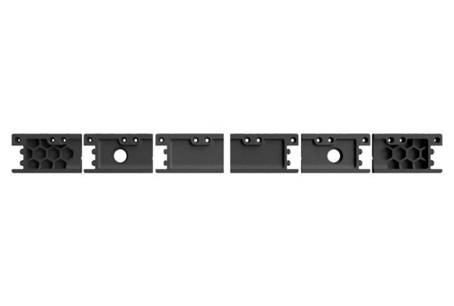

# Introduction

Take a deep breath for a second and realize something.

You… yes **YOU**, are about to commit to building a robot that can cut through metal, let alone your squishy human parts…
A machine that can easily electrocute you, cut you or set fire to your whole neighborhood if it's not given the respect it deserves.

**Please** give this machine the respect it deserves !!!

!!! warning

    Please follow the manual to the letter and perform any additional research you deem necessary before attempting to use it for the first time.

    If there is anything, and we mean _anything_ that you are curious or unsure about, you are more than welcome to ask us on our discord server.

    After all, you are special to us and we don't want you to get hurt.

Most importantly from everyone at the Millennium Machines design team,
Have fun building your very first Milo.

## Bill of materials

Provided [here](../../bom/sourcing_guide.md) is the bill of materials. Whilst we recommend that you try to stick to this list as much as possible, you're an adult (hopefully) and this is your machine. If there is a substitution that you think would lead to a better machine then do that. If there is a feature you don't feel is necessary then don't buy the parts for it.

Furthermore, there are options in the guide that are up to you to decide on, such as drivers, motors and even control boards. Do your research and find what you need to make your build work for you.

## Spindle selection

Milo supports 2 sizes of spindle - 70mm or 65mm. These cover the 2 most common spindle sizes for a DIY mill of this type. In terms of what you're looking for when buying a spindle, you'll want a minimum of 800w of power. You can then decide how you want to control your spindle - the simplest types are router style spindles which use a switch and or selector knob and provide the easiest way of interfacing with your spindle, and the most complex way involves using a VFD. With this setup you have more granular control over your settings, and can use outputs on your control board to control the spindle itself.

_NOTE_: There are too many styles of spindle to realistically account for, so if the spindle mount doesn't support your spindle then design a new one and send it our way and we may include it as an official user mod.

---

## Parts list and printing guidelines

The Millennium Machines team has provided a printing list with settings for you as a guideline for printing the parts necessary for the build. This list can be found [here](../../printing/print_guide.md).

Remember, these settings are only a guideline, and are open to your own interpretations - but we do highly recommend following them to achieve the best mechanical properties for each individual part.

## File naming

With your STL files downloaded and your printer warmed up, you may be wondering which parts to print in your favorite colors? Have no fear, we've got your back - each file is labelled.

### Primary color

Example: `Handwheel Body x2.stl`
These files have no prefix in their filename so are safe to print in your primary color.

### Accent color

Example: `[a] Table Bolt Down Bracket A x2.stl`
These files are prefixed with `[a]` and are intended to be printed in your chosen accent color.

### Quantity required

Example: `Handwheel Body x2.stl`
If any file ends with `_x#`, that is telling you the quantity of that part required to build the machine.

## Part versions

Example: `Skirt Front A xxxxxx.stl`

Note the descriptor at the end of the file name - while there are many types of skirt front "A" files, they all vary in their design and some are even mirrors of others so as to mount devices on either side.

!!! tip
    Some printed parts have multiple versions in order to cater for different machine setups - be aware that not all versions need to be printed to put your machine.

    {: .shadow}

    Choose the parts you need based on your build requirements.

---

## Drilling out holes

To make some features printable without support, some holes are printed with a sacrificial floor. These parts will need to be drilled and or cut out before use.

## T-Nuts application

This machine requires an immense amount of T-nuts. In the interest of simplifying this manual, we have chosen to omit the installation of T-nuts. Wherever a part interfaces with an extrusion in a way that looks like it requires a T-nut, then it should be considered a part that requires a T-nut.

---

## Pre-flight training

Before you head out on your journey to create skynet, it's probably a good idea that you learn a few things. Luckily the Millennium Machines team have put together a curated list of videos to teach you all you need to know - sit back, relax and enjoy.

- [How to lubricate your motion system](https://www.youtube.com/watch?v=UYvhYjkBFTY&list=PL7zrGeKp_8CTDOmpwZr5JnCSJqEghFh9j&index=39&t=816s)
- [How to use heat set inserts](https://www.youtube.com/watch?v=cyof7fYFcuQ&list=PL7zrGeKp_8CTDOmpwZr5JnCSJqEghFh9j&index=32)
- [Should you cold blue your rails ? And how to do it](https://www.youtube.com/watch?v=p6Id4Kl8RB0&list=PL7zrGeKp_8CTDOmpwZr5JnCSJqEghFh9j&index=10&t=210s)
- [How to get started with RepRap firmware on a fly board](https://www.youtube.com/watch?v=TAT532vIVzU)
- [CNC basics](https://www.youtube.com/watch?v=YBGqknN3gGs&t=466s)
- [Electronics connectors and how to use them](https://www.youtube.com/watch?v=y6G_MhQFv3k)
- [Cable chains and how not to use them](https://www.youtube.com/watch?v=_HiuY015rOY)

---

## CONTACT US

Building Milo can be confusing, but we're here to help.
Do you have a question?
Do you wanna show off your build?
Maybe do you just want someone to chat with?
Well, why not join our community here on:

- :fontawesome-brands-discord: **Discord** [https://discord.gg/ya4UUj7ax2](https://discord.gg/ya4UUj7ax2)
- :fontawesome-brands-reddit: **Reddit** [/r/MilleniumMachines/](https://www.reddit.com/r/MilleniumMachines/)
- :fontawesome-brands-youtube: **YouTube** [Millennium Machine Works Official](https://www.youtube.com/channel/UCfdxXilZd76Dp8RfLxUJ_Gw)
- :fontawesome-brands-github: **GitHub** [https://github.com/MillenniumMachines](https://github.com/MillenniumMachines)

---

[Next Chapter: Hardware reference](./hardware_reference.md)
