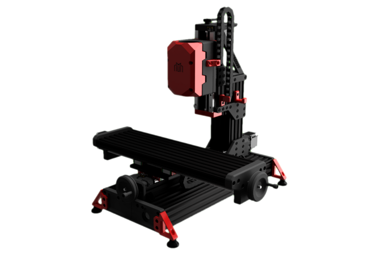
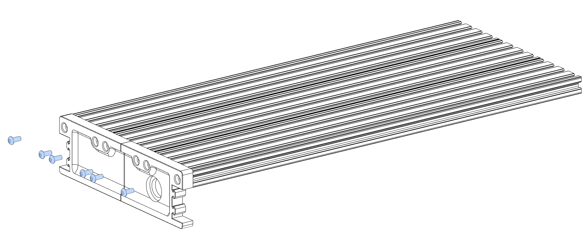
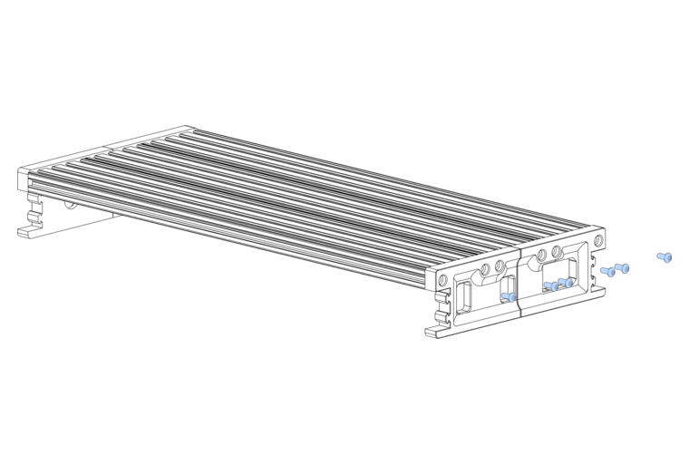
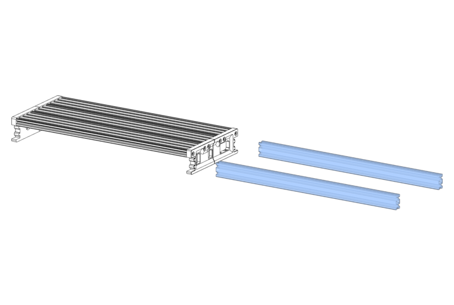
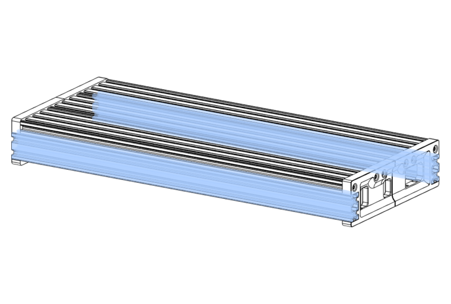
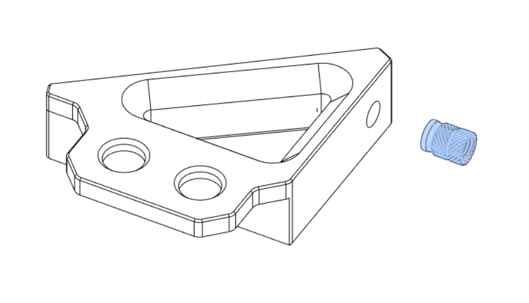
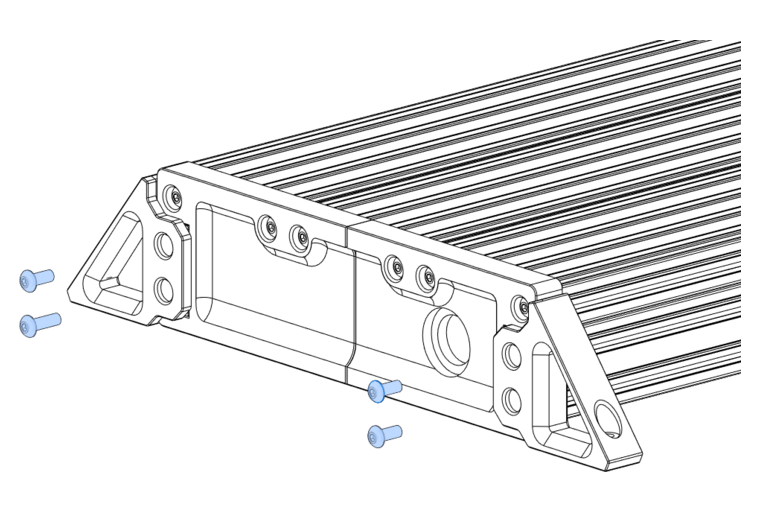

# Table Assembly



---

!!! info annotate "Components Required"
    ```
    20 x M5x12mm BHCS
    12 x M3x10mm SHCS
     4 x TPU Feet (1)
     4 x M5 Heat-set Insert
     3 x Openbuilds 2080 Extrusion - 550mm
     2 x Openbuilds 2040 Extrusion - 580mm
     2 x Table Bolt Down Bracket A (2)
     2 x Table Bolt Down Bracket B (3)
     1 x Skirt Front A (4)
     1 x Skirt Front B (5)
     1 x Skirt Back A (6)
     1 x Skirt Back B (7)
    ```
1. :material-printer-3d-nozzle-heat-outline: Optional - print this part using the [recommended settings](../../printing/print_guide.md#electronics-table)!
2. :material-printer-3d-nozzle-heat-outline: Print this part using the [recommended settings](../../printing/print_guide.md#electronics-table)!
3. :material-printer-3d-nozzle-heat-outline: Print this part using the [recommended settings](../../printing/print_guide.md#electronics-table)!
4. :material-printer-3d-nozzle-heat-outline: Print this part using the [recommended settings](../../printing/print_guide.md#electronics-table)!
5. :material-printer-3d-nozzle-heat-outline: Print this part using the [recommended settings](../../printing/print_guide.md#electronics-table)!
6. :material-printer-3d-nozzle-heat-outline: Print this part using the [recommended settings](../../printing/print_guide.md#electronics-table)!
7. :material-printer-3d-nozzle-heat-outline: Print this part using the [recommended settings](../../printing/print_guide.md#electronics-table)!

Lay the 3 x 2080 extrusions next to each other length-ways, and attach the Skirt Front A and Skirt Front B using M5x12mm BHCS.

!!! tip
    This is easiest to do upside-down!

{: .shadow}

---

Attach the Skirt Back A and Skirt Back B using M5x12 BHCS.

{: .shadow}

---

Slide the 2040 extrusions into the channels on either side of the skirt pieces.

{: .shadow}

---

Make sure they sit flush with the front and back of the skirts.

{: .shadow}

---
Install an M5 Heat-set insert into each table bolt-down bracket.

{: .shadow}

---

Use M5x12mm BHCS to attach the table bolt-down brackets to each corner of the electronics enclosure.

{: .shadow}

---

If you want to raise your table, now is the time to install your TPU feet using M5x30mm BHCS!

{: .shadow}

---

Fix the table to the Y axis of the mill using 3 corner brackets placed equispaced along both sides.

{: .shadow}

---
!!! success ":fontawesome-solid-champagne-glasses: Congratulations!"
    You're to move onto your electronics and cabling! Head over to
    the [Electronics Manual](../../electronics_manual/index.md) to get started!