# X Axis Assembly

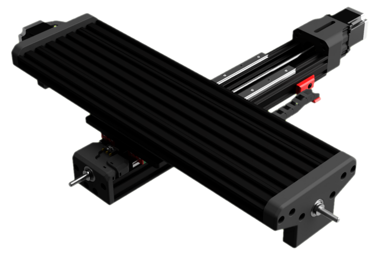

---

> M3x10mm SHCS
> MGN15 500mm Rails
> C-beam 500mm

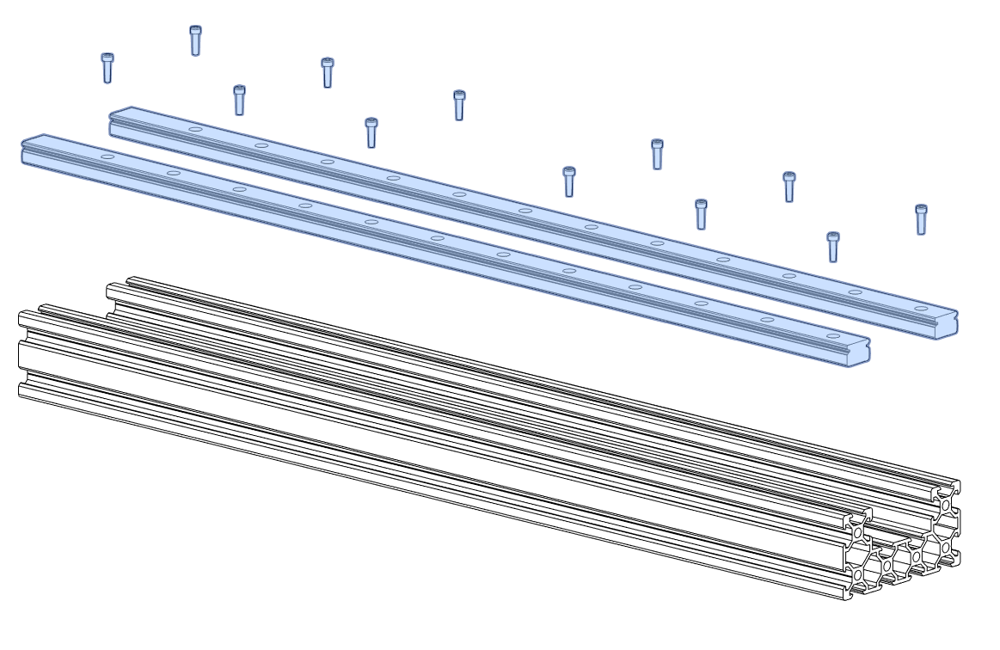

---

> F608ZZ bearing
> 608ZZ bearing

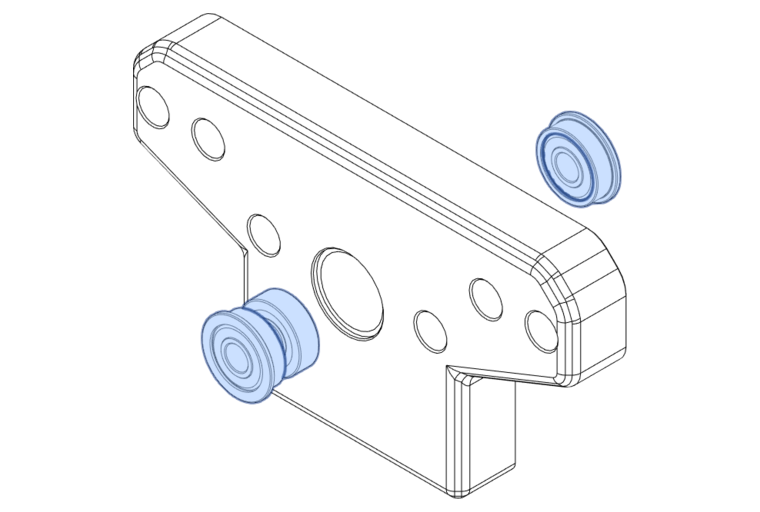

> M2.5 Heat Insert
> M3 Heat Insert
> M5 Heat Insert

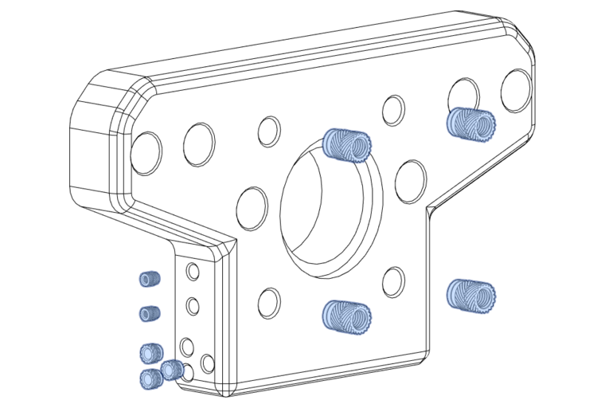

---

> M5x12mm BHCS

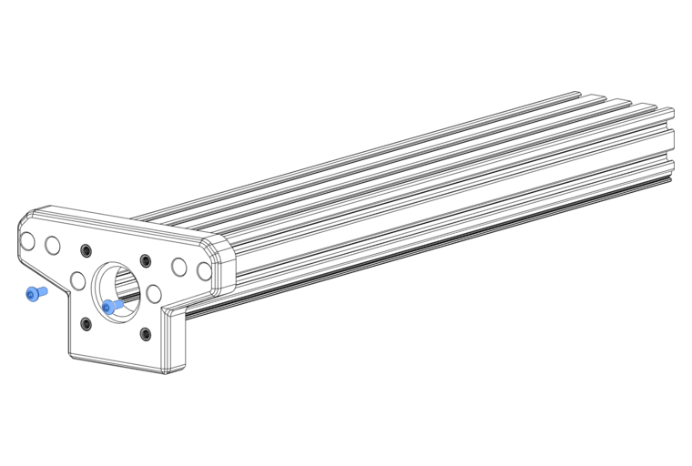

---

> M5x12mm BHCS
> 2080 500mm

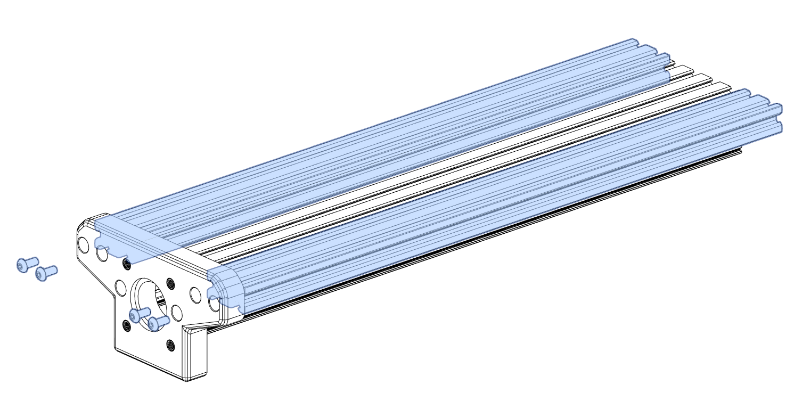

---

> M5x12mm BHCS

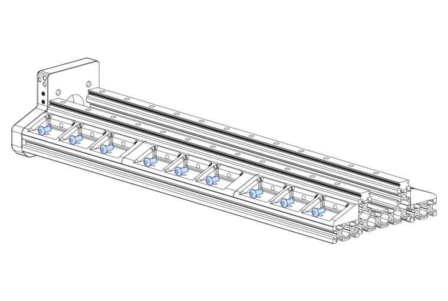

---

> M5x8mm BHCS

---

---

> 550mm leadscrew
> 8 to 6.35mm rigid coupler

<!-- This image is reused from the y axis assembly on purpose -->
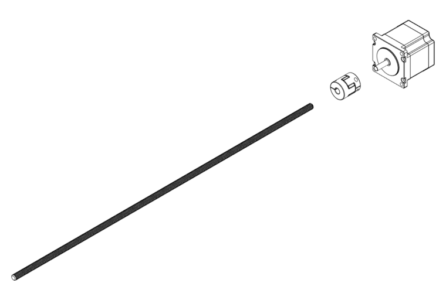

---

---

> M5x20mm SHCS

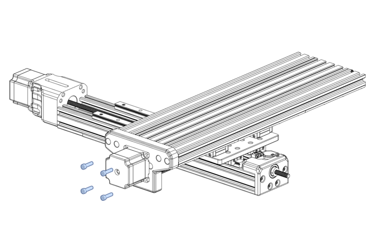

---

## Install locking collar on leadscrew

Install both locking collars onto the leadscrew without tightening either locking collars.

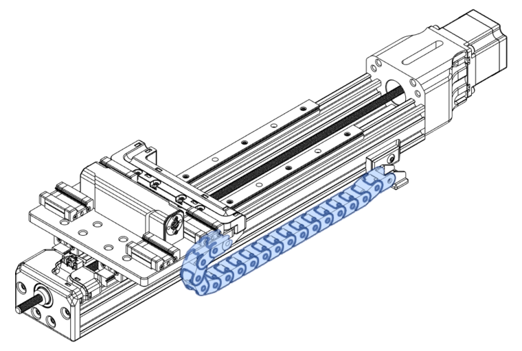

---

> M5x12mm BHCS

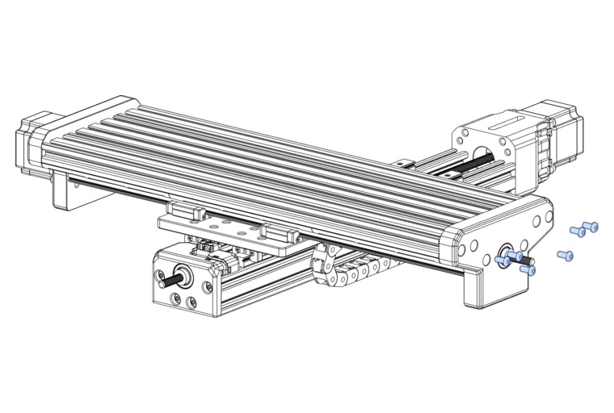

---

## Locking collar preload

Using your fingers, press each locking collar towards each other - driving them into the face of each bearing with moderate to high pressure. Tighten the inner collar first before tightening the external side collar. This will ensure that the screw remains in the same position during use.

_NOTE_: add some medium-strength thread-lock to the set screw.

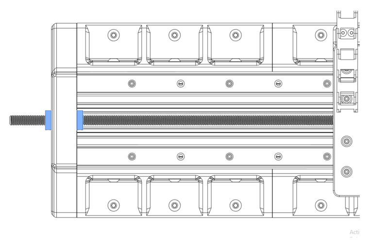

---

## Drag chain orientation

Drag chains have 2 different sides - a fixed side and a free side. For this setup, the fixed side is connected to the XY Drag Chain Transition. The free side attaches itself to the X Motor Mount.

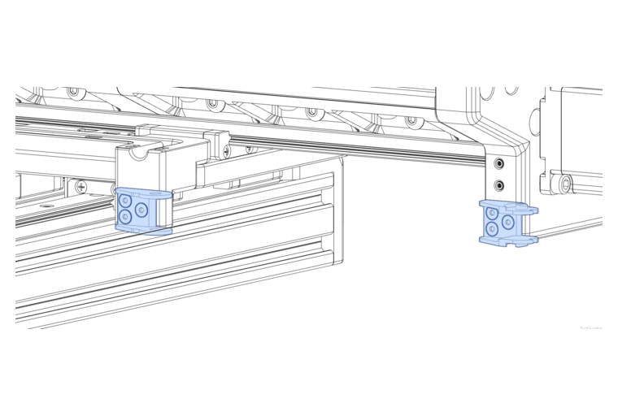

---

## Cable chain optional installation point

You may wish to install the rest of the cable chain now to complete the X axis, however it is often easier to thread your X axis motor and X endstop cables through the loose chain before installing it - otherwise it can become quite a tight space to work in later.

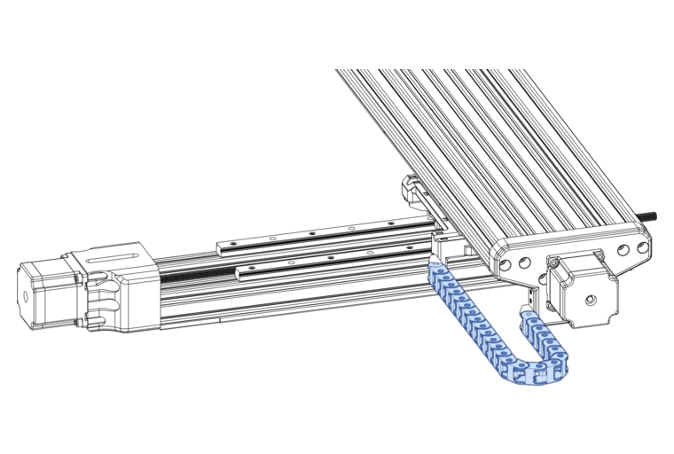

---

## X-Endstop installation process

To avoid the endstop getting damaged during the rest of the assembly, its a good idea not to install it at this point, but rather install it later with the rest of the wiring.

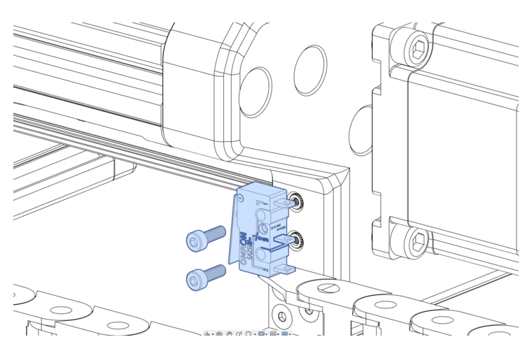

---

[Next Chapter: Z Axis Assembly](./z_axis_assembly.md)
