# Y Axis Assembly

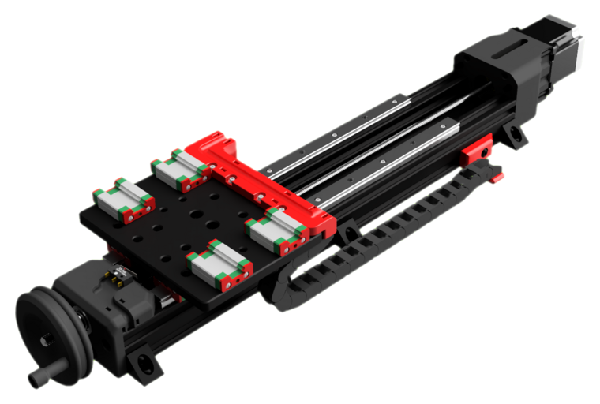

---

## X/Y Plate Orientation

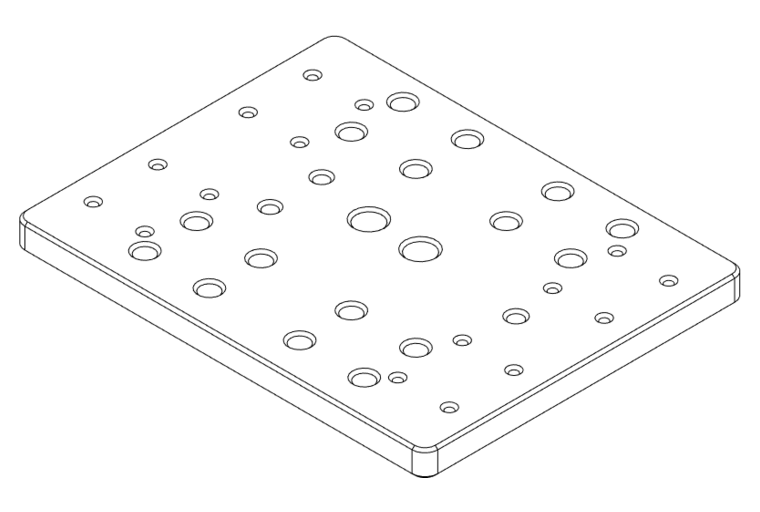{: .shadow}

The X/Y gantry plate is not an exact mirrored part, and therefore needs to be oriented in the right direction for correct installation..

To make sure that the plate is installed the right way round, rotate the plate until counterbores `A` are facing upwards.

With the counterbores the right way round, locate hole `B` and make sure it is on the right side of the plate.

After this has been done, face `C` will now be oriented towards you. When installed, this face will be towards `Y` minimum (or towards the operator).

---
## X/Y Gantry Plate

!!! info annotate "Components Required"
    ```
    16 x M3x10mm SHCS
    12 x M3x5mm SHCS
     5 x M5 Heat-set Insert
     4 x M3x20mm SHCS
     4 x M3 Washer
     4 x Rail Carriages
     1 x X/Y Gantry Plate (1)
     1 x X/Y Drag-Chain Transition (2)
    ```
1. For additional strength this part should be machined :material-saw-blade: but it can be printed :material-printer-3d-nozzle-heat-outline: using the [recommended settings](../../printing/print_guide.md) if necessary.
2. Print :material-printer-3d-nozzle-heat-outline: this part using the [recommended settings](../../printing/print_guide.md)!

Attach the lower rail `Y` carriages using M3x5mm SHCS.

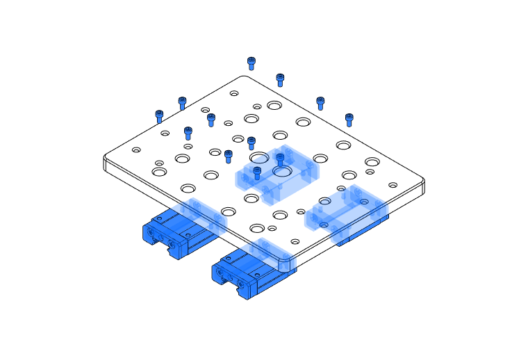{: .shadow}

!!! note
    Install the bolts from front to rear. The 4 holes furthest from you will not be populated at this stage, as these holes are also used to mount the cable channel on the rear of the plate.

---

Attach the upper rail `X` carriages using M3x10mm SHCS.

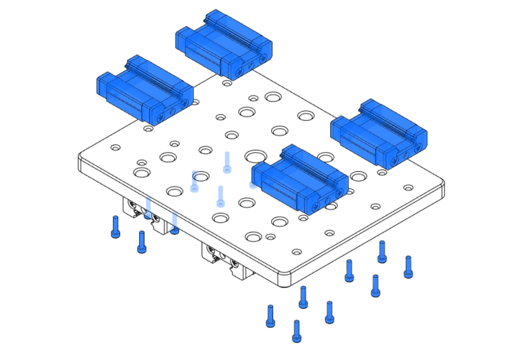{: .shadow}

!!! warning "BE SAFE, LOCK IT!"
    These machines vibrate an immense amount when in use, and fasteners are bound to back out. Don't be afraid to add a little bit of medium-strength thread-lock to all your screws to avoid this problem.

!!! warning "Protect your rail carriages"
    Rail carriages should always have a rail or [dummy rail](https://github.com/MilleniumMills/Millenium-Milo-v1.5/tree/main//STL%20Files/Tools/Dummy%20Rail.stl) installed in them to avoid damaging them. If your rails didn't come with dummy rails, then print the ones we provided for you in the print list.

    {: .shadow}

---

Insert the M3 Heat-set inserts into the X/Y Drag-Chain Transition.

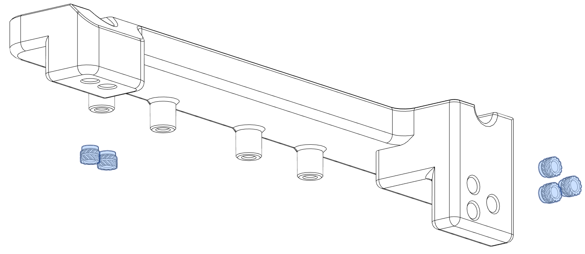{: .shadow}

---

Fasten the X/Y Drag-Chain Transition to the X/Y plate using M3x20mm SHCS and one M3 washer each.

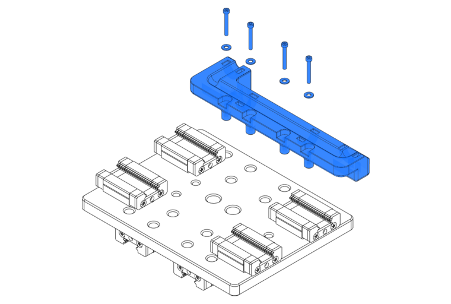{: .shadow}

---
## X and Y Anti-Backlash Nuts

!!! info annotate "Components Required"
    ```
     8 x M3x8mm SHCS
     8 x M3 Heat-set Insert
     5 x M5 Heat-set Insert
     4 x Brass Lead-screw Nut
     4 x M5x16mm BHCS
    ```
1. For additional strength this part should be machined :material-saw-blade: but it can be printed :material-printer-3d-nozzle-heat-outline: using the [recommended settings](../../printing/print_guide.md) if necessary.
2. Print :material-printer-3d-nozzle-heat-outline: this part using the [recommended settings](../../printing/print_guide.md)!

Insert the M3 and M5 heat-set inserts into the Y-Axis Anti-Backlash Nut.

{: .shadow}

---

Fasten the Lead-screw nuts loosely on either side of the Y-Axis Anti-Backlash Nut using M3x8mm SHCS.

{: .shadow}

---

Insert the M3 and M5 heat-set inserts into the X-Axis Anti-Backlash Nut.

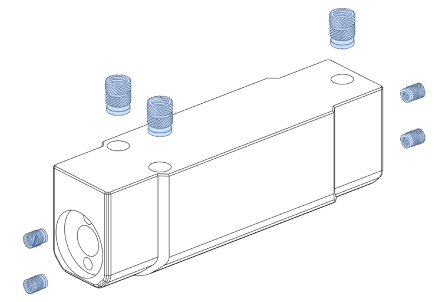{: .shadow}

---

Fasten the Lead-screw nuts loosely on either side of the X-Axis Anti-Backlash Nut using M3x8mm SHCS.

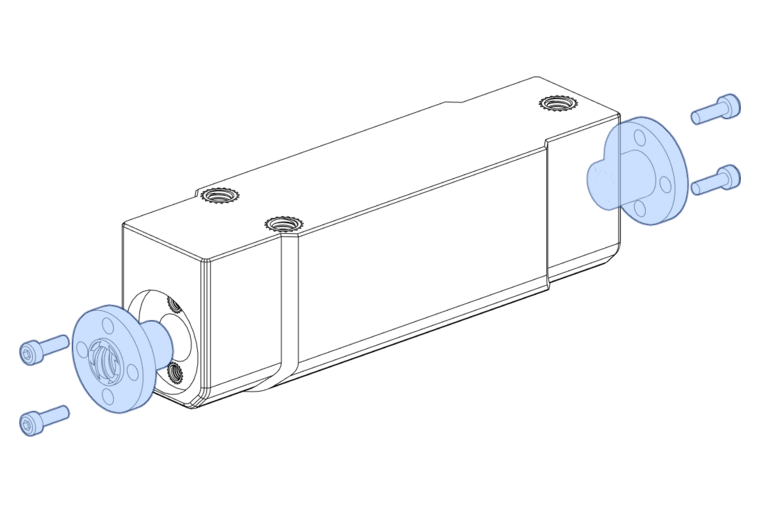{: .shadow}

---

Fasten the Y-Axis Anti-Backlash Nut to the bottom of the X/Y plate using M5x16mm BHCS.

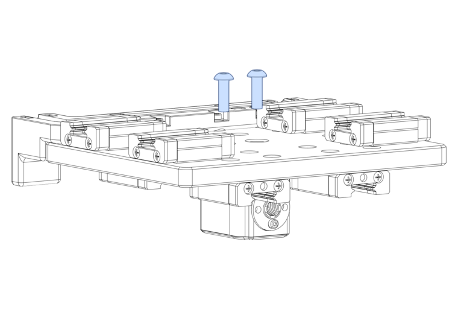{: .shadow}

---

Fasten the X-Axis Anti-Backlash Nut to the top of the X/Y plate using M5x16mm BHCS.

{: .shadow}

!!! warning "Anti-Backlash Preload Tuning"

    Each axis uses anti-backlash[^1] blocks in order to compensate for changes in screw direction during operation. They do this by driving 2 brass TR8x8 lead screw nuts towards each other to engage both sides of the lead screw threads.

    In order for this to work the preload required to drive each nut needs to be tuned by hand. To tune the preload make sure the lead-screws are greased appropriately, then install the 2 brass TR8x8 lead screw nuts within the anti backlash block.

    Tighten the screws on one of the nuts so that it does not move, while leaving the other nut loose.

    Install the greased lead screw temporarily into the block and begin to tighten the loose nut, taking care to apply the same number of turns to each of the screws.

    The ideal preload will allow for the leadscrew to still spin by hand but should have a moderate amount of resistance to it.
    Once complete make sure each bolt has thread-lock applied, and uninstall the leadscrew - your preload is now set. To avoid any headaches, do this before final installation.

[^1]: Yes technically it's a "zero backlash" nut and not an "anti-backlash nut", but the common term for it is anti-backlash and that's what most people know it as.

---
## Y-Axis Motor Mount and Bearing Block

!!! info annotate "Components Required"
    ```
     4 x 608ZZ Bearing
     4 x M5 Heat-set Insert
     2 x F608ZZ Bearing
     2 x M2.5 Heat-set Insert
     6 x M5x12mm BHCS
     1 x Openbuilds C-Beam 470mm
     1 x Y-Axis Motor Mount (1)
     1 x Y-Axis Bearing Block (2)
    ```
1. Print :material-printer-3d-nozzle-heat-outline: this part using the [recommended settings](../../printing/print_guide.md)!
2. Print :material-printer-3d-nozzle-heat-outline: this part using the [recommended settings](../../printing/print_guide.md)!

Insert the M5 heat-set inserts into the Y-Axis Motor Mount.

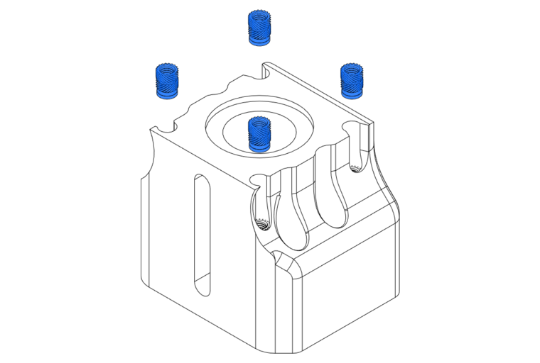{: .shadow}

!!! tip
    The motor mount has been redesigned so yours will be shorter than the one in this image. On the shorter mount, the heat-set inserts can be installed from the flat side of the mount (the side that printed against the bed).

    These inserts are much more resistant to being pulled out of the mount than the ones in the older style motor mount, especially when over-torquing the motor bolts.

---

Insert the M2.5 heat-set inserts into the Y-Axis Bearing Block.

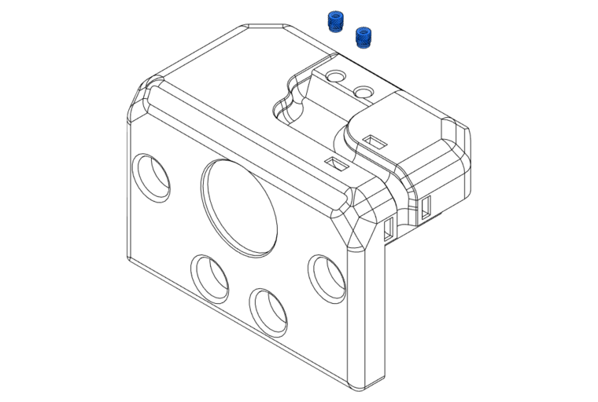{: .shadow}

---

Insert a bearing stack (1 x F608ZZ and 2 x 608ZZ bearings) on either side of the Y-Axis Bearing Block. The flange of the F608ZZ bearings should sit flush with the bearing block faces on either side.

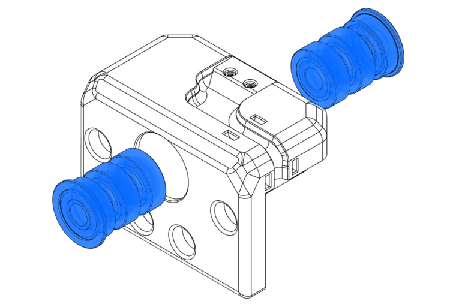{: .shadow}

---

Fasten the Y-Axis Motor Mount to the 470mm C-Beam using M5x12mm BHCS.

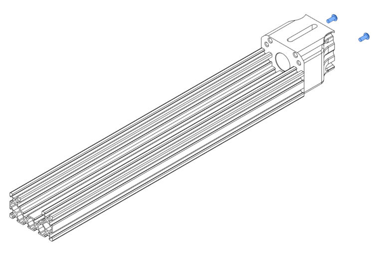{: .shadow}

---

Fasten the Y-Axis bearing block to the other end of the 470mm C-Beam using M5x12BHCS

!!! tip
    The Y-Axis Bearing Block is used as a stopper to install the rails - it will be removed later, so there is no need to thread-lock it at this point.

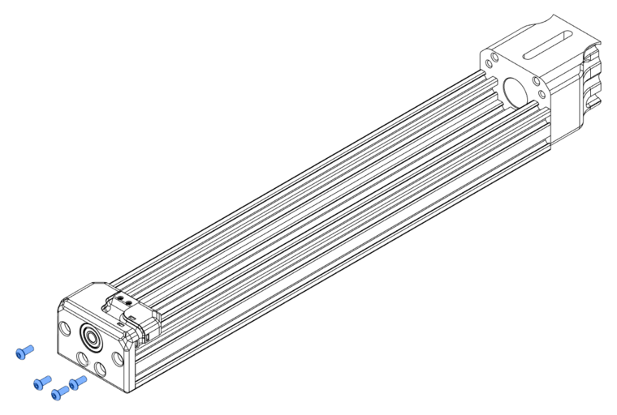{: .shadow}

---

## Y-Axis Rails

!!! info annotate "Components Required"
    ```
    10 x M3x10mm BHCS
    10 x M3 Spring T-Nut
     2 x MGN15 Linear Rails, 350mm
    ```

Fasten the MGN15 rails to the Y-Axis, screwing M3x10mm SHCS into every second hole in the rail.

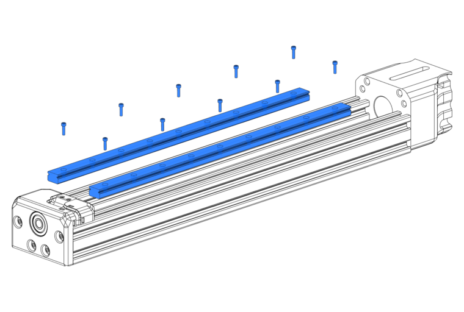{: .shadow}

!!! note "T-Nut Installation"
    Spring T-Nuts are used here to mount the rails but are not shown, install these prior to screwing the bolts in.

!!! tip "Rail Centering Guide"
    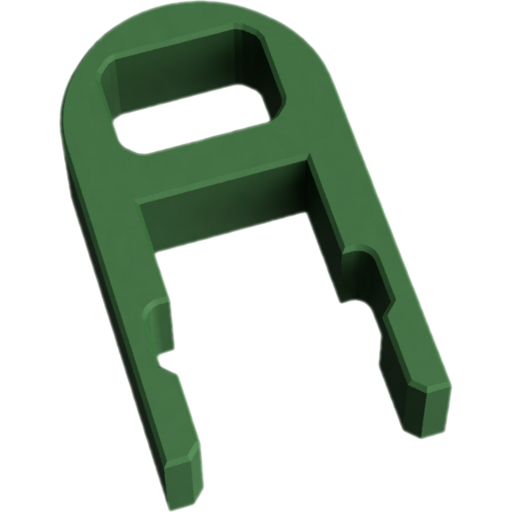{: .shadow}

    Use the MGN15 guides to position the rail in the center of the extrusion prior to fastening the screws.

---

## Uninstall the Y-Axis Bearing Block

The Y-Axis Bearing Block needs to be uninstalled before installing the X/Y Gantry Plate.

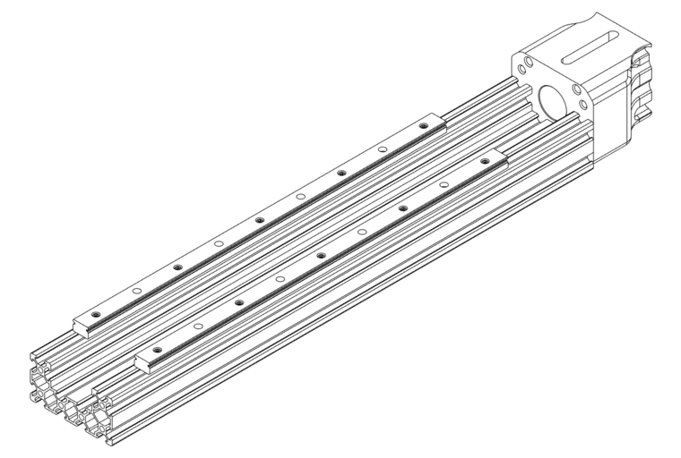{: .shadow}

---

Carefully, slide the X/Y Gantry Plate assembly onto the rails.

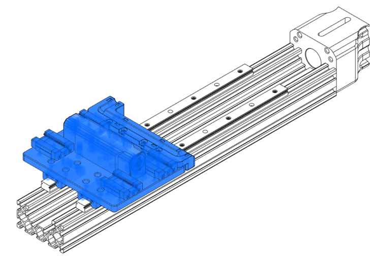{: .shadow}

!!! warning
    Take care when installing carriages onto the rails!

    Improper handling of carriages can damage them - the best way is to install a dummy rail in the carriages and then transfer onto the steel rails.

---

## Y-Axis Bearing Block, Lead-Screw and Motor

!!! info annotate "Components Required"
    ```
    4 x M5x30mm SHCS
    4 x M5x12mm BHCS
    2 x Locking Collar
    1 x 550mm Lead-Screw
    1 x NEMA23 Motor
    1 x 8 to 6.35mm Rigid Coupler
    ```
Install the Y-Axis Bearing Block for the final time using M5x12mm BHCS. Be sure to use medium-strength thread-lock here.

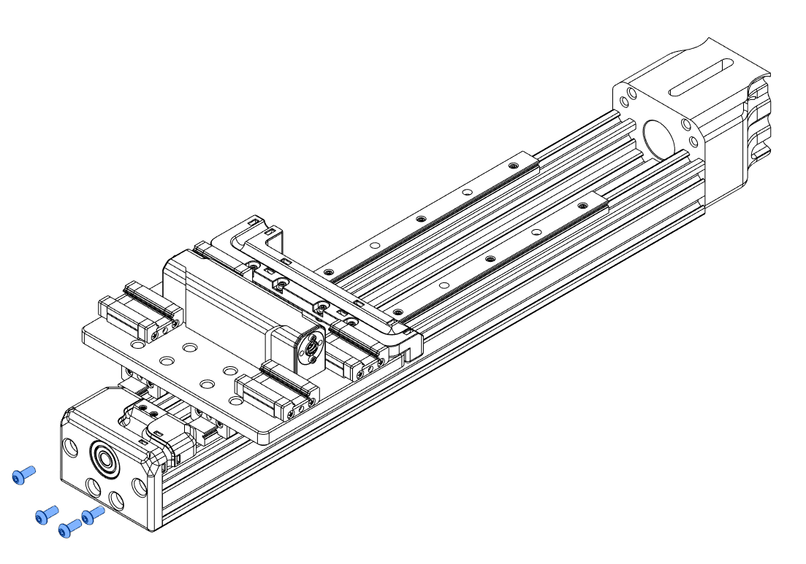{: .shadow}

---

Using an 8 to 6.35mm rigid coupler, attach the 550mm lead-screw to the NEMA23 motor.

{: .shadow}

!!! warning
    Remember to apply medium-strength thread-lock to the coupler grub screws. There's nothing worse than trying to diagnose a stationary axis and noticing that your motor is spinning but nothing else is!

---

From the back of the Y-Axis assembly, insert the screw and motor assembly. Be sure to thread it through the Y Anti-Backlash Nut, but do not insert it through the bearing block yet.

{: .shadow}

---

Before pushing the leadscrew through the bearing block, add a locking collar to the inside bearing face. Leave this loose.

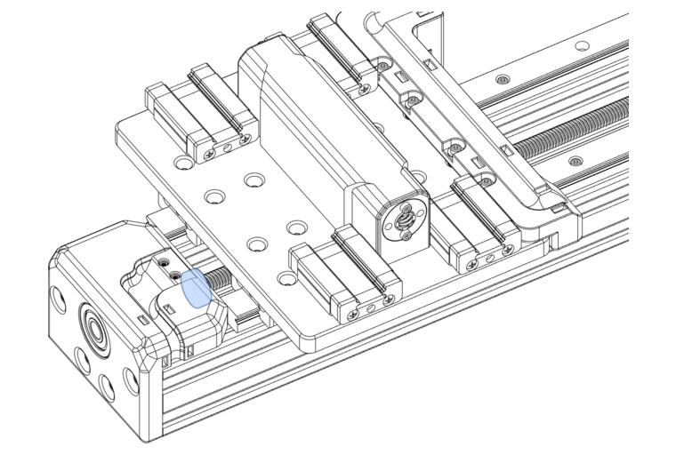{: .shadow}

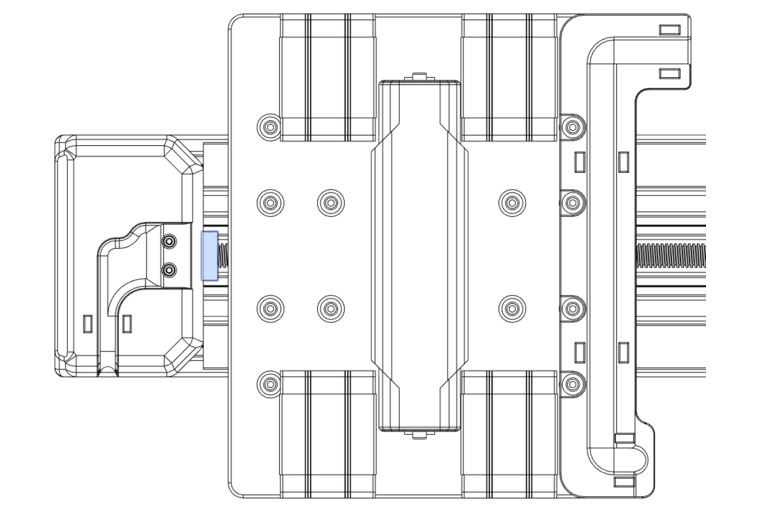{: .shadow}

---

Fasten the NEMA23 motor to the Y-Axis motor mount using M5x30 SHCS.

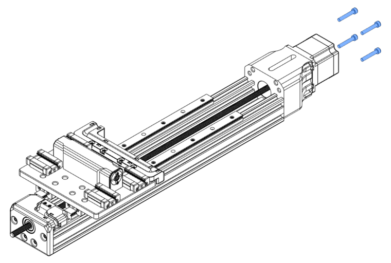{: .shadow}

---

Add the last locking collar on the operator side of the bearing block.

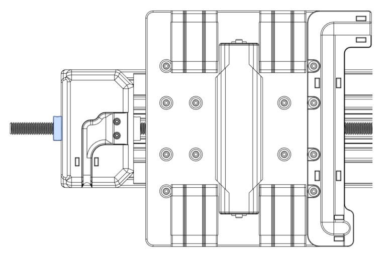{: .shadow}

---

## Locking collar preload

Using your fingers, press each locking collar towards each other - driving them into the face of each bearing with moderate to high pressure. Tighten the operator side collar first before tightening the internal side collar. This will ensure that the screw remains in the same position during use.

!!! note
    Add some medium-strength thread-lock to the set screw.

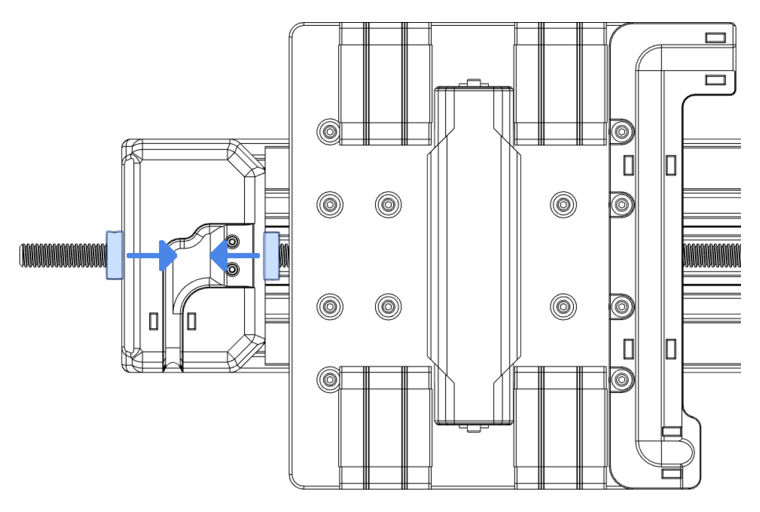{: .shadow}

---


## Y-Axis Endstop Installation Process

To avoid the endstop getting damaged during the rest of the assembly, its a good idea not to install it at this point, but rather install it later with the rest of the wiring.

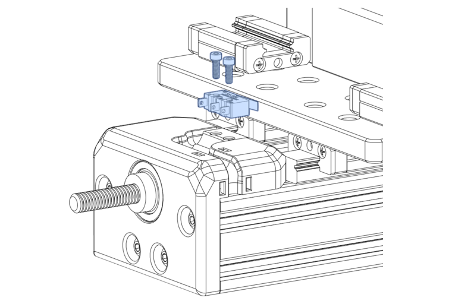{: .shadow}

---

> M3 Heat Insert

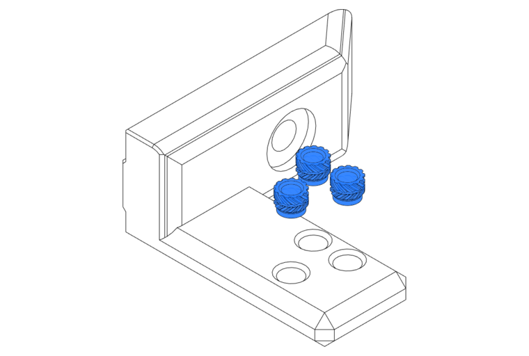{: .shadow}

> M5x12mm BHCS

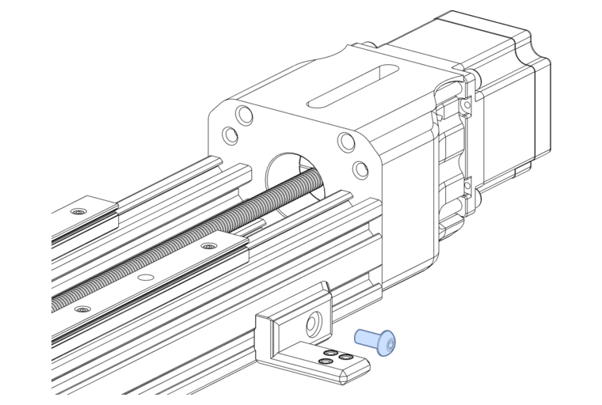{: .shadow}

---

## Drag chain orientation

Drag chains have 2 different sides - a fixed side and a free side. For this setup, the free side is connected to the rear drag chain mount shown on the last image. The fixed side attaches itself under the XY transition piece.

> M3x6mm FHCS

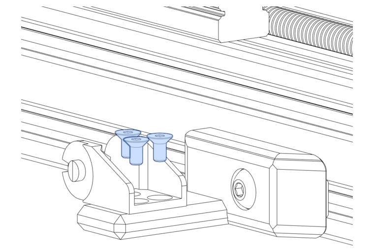{: .shadow}
{: .shadow}

---

<!-- TODO do a composite image to replicate the zoom in done in the original manual -->

## Cable tie points

It's a good time to mention that the little cutouts that you may have noticed scattered around the build are for your zip ties. Use these to secure your cables where necessary.

## Cable chain optional installation point

You may wish to install the rest of the cable chain now to complete the Y axis, however it is often easier to thread your X axis motor and X endstop cables through the loose chain before installing it as it can become quite a tight space to work in later.

!!! note
    Remember this chain is for X axis cables despite being mentioned now during Y axis assembly.

{: .shadow}

---

[Next Chapter: X-Axis Assembly](./x_axis_assembly.md)
