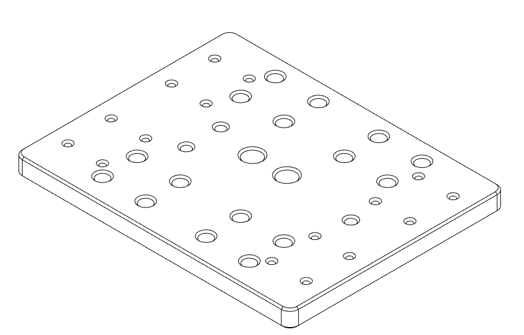
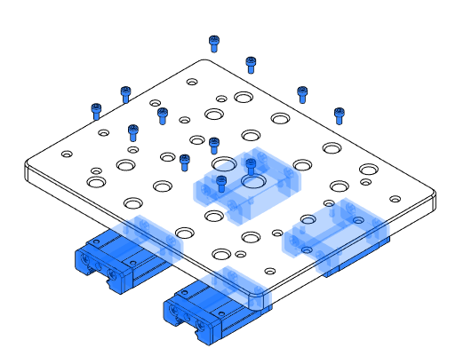
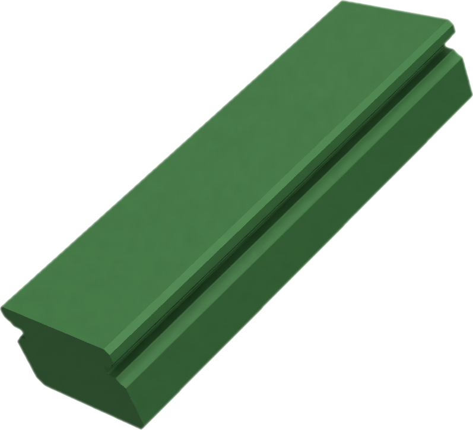
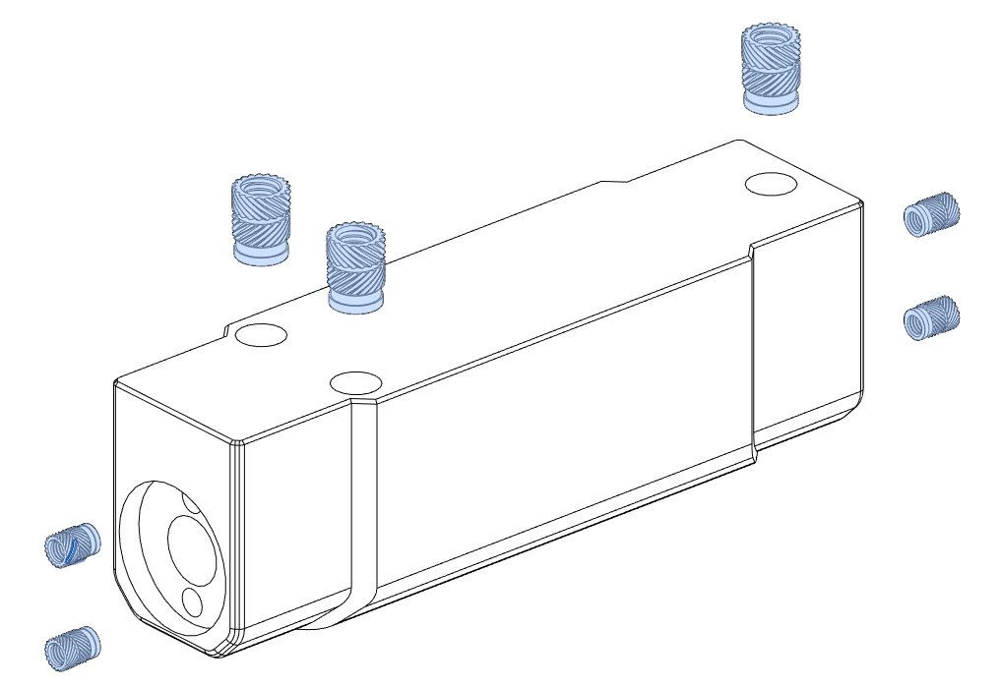
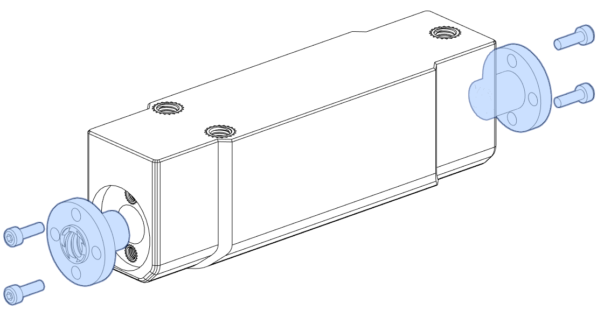
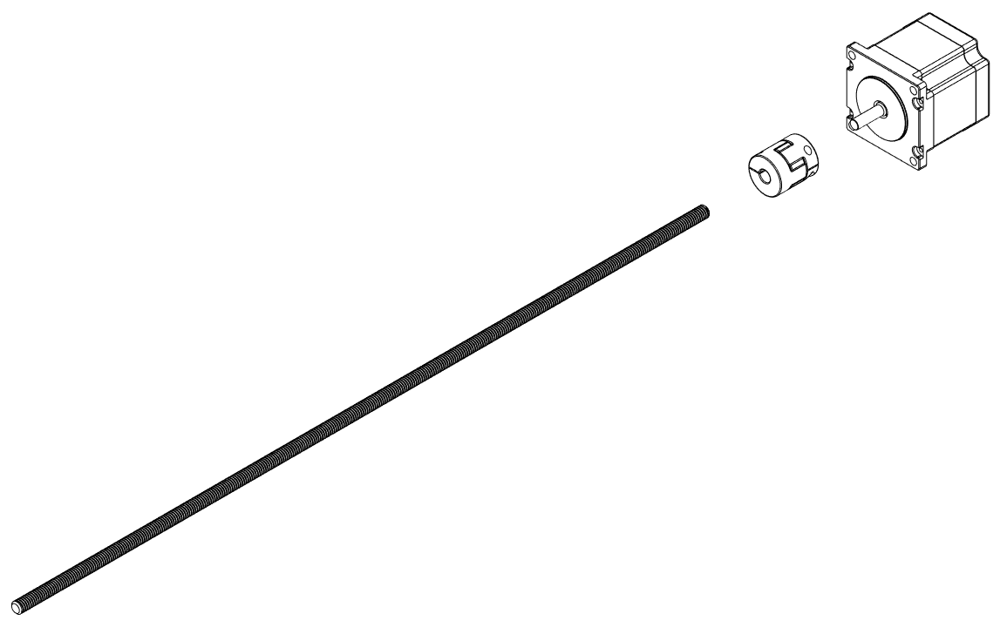
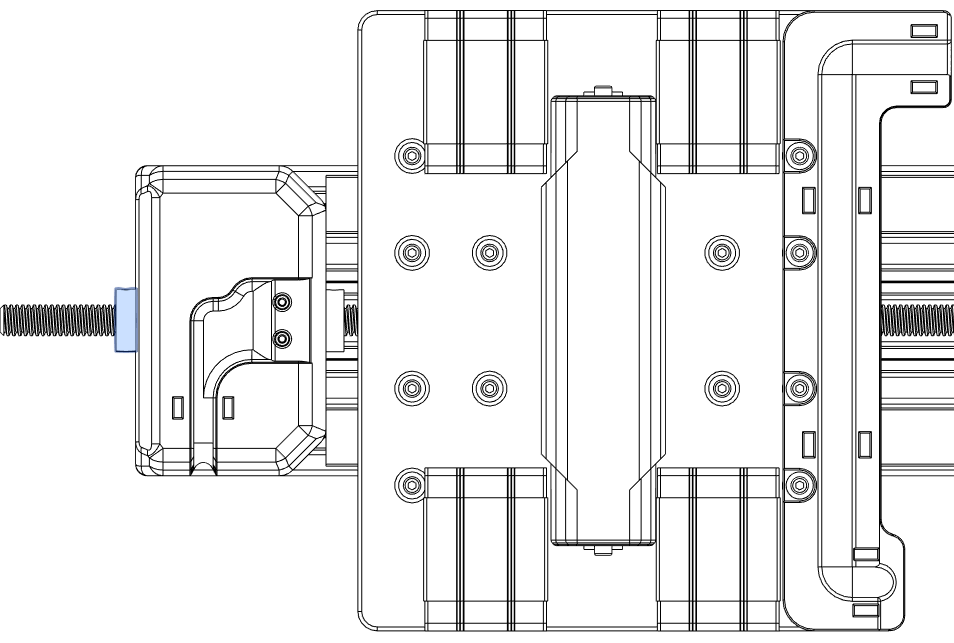

# Y Axis Assembly

---

## XY plate orientation

The XY gantry plate is not an exact mirrored part and therefore needs to be oriented in the right directions in order for it to be installed correctly.

To make sure that the plate is installed the right way round rotate the plate until counterbores “a” are facing upwards.

With the counterbores the right way round locate hole “b” and make sure it is on the right side of the plate.

After this has been done face “c” will now be oriented towards you, when installed this face will be towards Y minimum (or towards the operator).

---

> M3x5mm SHCS

> M3x10mm SHCS

### BE SAFE , LOCTITE IT !

These machines vibrate an immense amount
when in use and fasteners are bound to back out. don’t be afraid to add a little bit of loctite to all your screws to avoid this problem

### Protect your rail carriages

Rail carriages should always have a rail or dummy rail installed in them to avoid getting them damaged.  If your rails didn’t come with dummy rails then print the ones we provided for you in the print list.

---

> M3 Heat Insert

---

> M3 washer
> M3x20mm SHCS

---

> M5 Heat Insert
> M3 Heat Insert

> M3x8mm SHCS
> Brass leadscrew nut

---

> M3 Heat Insert
> M5 Heat Insert

> M3x8mm SHCS
> Brass leadscrew nut

---

> M5x16mm BHCS

---

> M5x16mm BHCS

---

## ANTI-BACKLASH PRELOAD TUNING

Each axis uses anti-backlash* blocks in order to compensate for changes in screw direction during operation. They do this by driving 2 brass TR8x8 lead screw nuts towards each other to engage both sides of the lead screws threads. In order for this to work the preload required to drive each nut needs to be tuned by hand. To tune the preload make sure the screws are greased appropriately then loosely install the 2 brass TR8x8 lead screw nuts within the anti backlash block without tightening the bolts too much. Then install a spare lead screw temporarily in the block and begin to tighten each brass nut equally.
The ideal preload will allow for the leadscrew to still spin by hand but should have a moderate amount of resistance to it. Once complete make sure each bolt has loctite applied  uninstall the leadscrew and your preload is now set.  To avoid any headaches attempt to do this before final installation.

\*Yes technically it’s a “zero backlash” nut and not an “anti-backlash nut”, but the common term for it is anti-backlash and that’s what most people know it as.

---

> M5 Heat Insert

> M2.5 Heat Insert

---

> F608ZZ bearing
> 608ZZ Bearing

---

> C-Beam 470mm
> M5x12mm BHCS

## Temporarily install the Y Bearing block

The Y bearing block is used as a stop to install the Y rails, it will then be removed later so there is no need to loctite it at this point.

> M5x12mm BHCS

---

## T-nut installation

Spring T-nuts are used here to mount the rails but are not shown, install these prior to the screwing the bolts in.
)
> M3x10mm SHCS
> MGN15 350mm Rails

## Rail centering Guide

Use the MGN15 guides to position the rail in the center of the extrusion prior to fastening Front the screws.

---

## Uninstall the Y Bearing block

The Y bearing block needs to be uninstalled before being able to install the the XY carriage.

---

## Take care when installing Carriages onto rails

Improper handling of carriages can damage them the best way to install a dummy rail in the carriages and then transfer onto the steel rails.

---

## Install the Y bearing block for the final time

This will be the final installation of the Y bearing block be sure to use loctite.

> M5x12mm BHCS

---

> 550mm leadscrew
> 8 to 6.35mm rigid coupler

---

## Install the Y screw, coupler and motor

From the back of the Y axis insert the Y screw assembly, be sure to thread through the Y anti-backlash nut. However do not insert it through the bearing block yet.

---

## Install Locking collar on leadscrew

Before pushing the leadscrew through the bearing block don’t forget to add a locking collar to the inside bearing face. Leave this loose.

---

> M5x30 SHCS

---

## Install Locking collar on leadscrew

Add the last locking collar on the operator side of the bearing block. Do not tighten the set screw yet.

---

## Locking collar preload

Using your fingers press each locking collar towards each other, driving them into the face of each bearing with moderate to high pressure. Tighten the operator side collar first before tightening the internal side collar this will ensure that the screw remains in the same position during use.

NOTE : add some loctite to the set screw.  

---

## Y Endstop installation process

To avoid the endstop getting damaged during the rest of the assembly its a good idea not to install it at this point, but rather install it when you do you’re wiring.

---

> M3 Heat Insert

> M5x12mm BHCS

---

## Drag chain orientation

Drag chains have 2 different sides a fixed side and a free side for this setup the free side is connected to the rear drag chain mount shown on the last page. The fixed side attaches itself under the XY transition piece

> M3x6mm FHCS

---

<!-- TODO do a composite image to replicate the zoom in done in the original manual -->

## Cable tie points

It’s a good time to mention that the little cutouts that you may have noticed scattered around the build are for your zip ties, use these to secure your cables down where necessary.

## Cable chain optional installation point

You may wish to install the rest of the cable chain now to complete the Y axis, however , it is often easier to thread your X axis motor and X endstop cables through the loose chain before installing it otherwise it can become quite a tight space to work in later.
Note:  Remember This chain is for X axis cables despite being mentioned now during Y axis assembly.

---

[Next Chapter: X Axis Assembly](./x_axis_assembly.md)
