# Z Axis Assembly

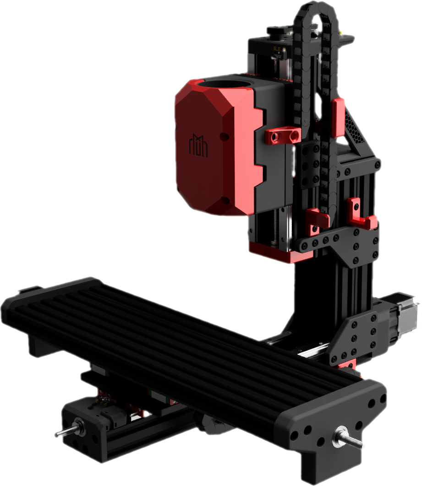

---

## Identifying extrusions

This section of the build contains a few C-beams that are close together. To help you identify which parts are which, lay out your extrusions like the diagram shown on this page. The next steps will then highlight which extrusions are used for each step.

A : Openbuilds 4080x260mm C-Beam
B : Openbuilds 4080x260mm C-Beam
C : Openbuilds 4080x250mm C-Beam
D : Openbuilds 4080x120mm C-Beam

---

> M5x12mm BHCS

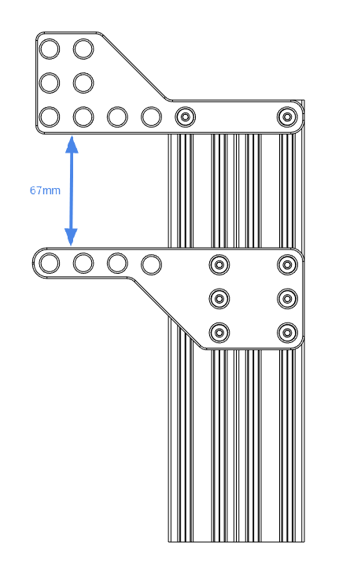

---

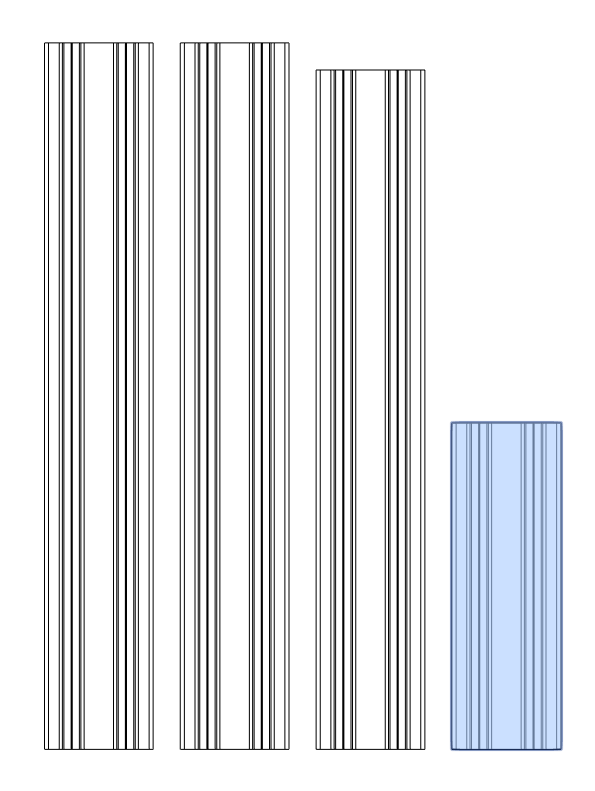

> M5x12mm BHCS

---

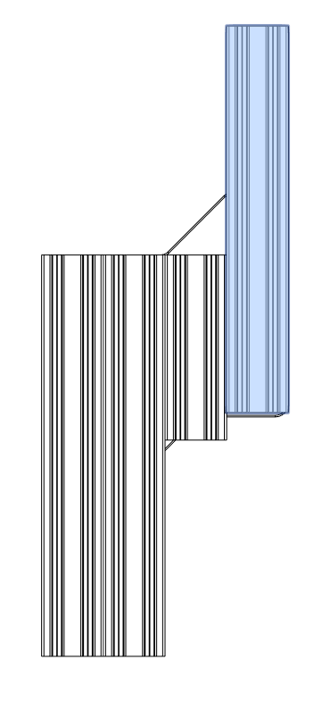

<!-- TODO do a composite image showing the zoom in -->

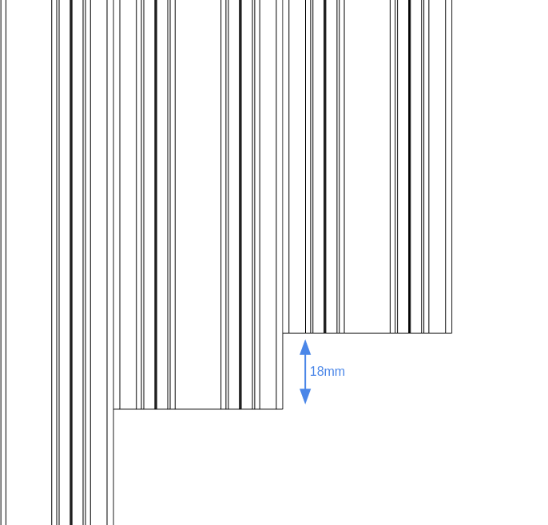

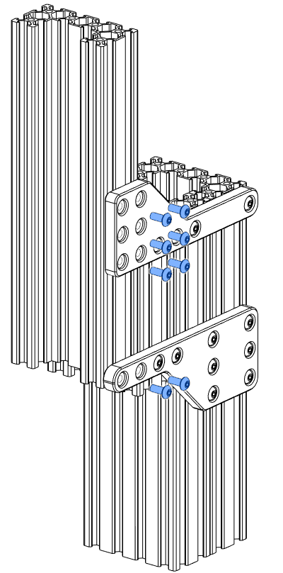

---

## Install the mirrored column plates

At this point it is best to install the column plates on the other side of the column.

> 608ZZ bearing

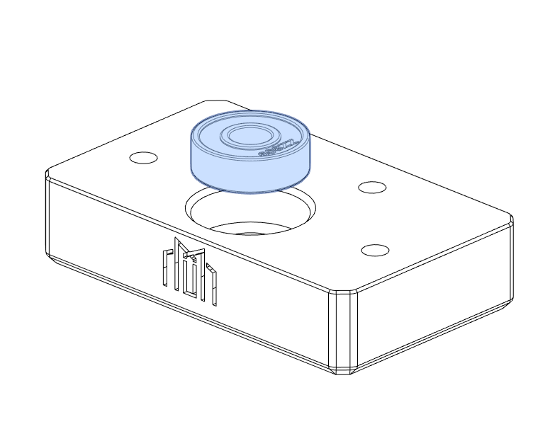

> M5x12mm BHCS

---

## Ballast box

The ballast box is designed to house a damping load such as sand or epoxy granite. It is not a requirement but is recommended.

## Install at an angle

There is a small lip in the ballast box which registers with the tongue on the ballast top. This is easiest to install at an angle.

_NOTE_: Once the ballast top is installed, it can be difficult to remove. Be sure that no other steps need to be taken before sealing the lid.

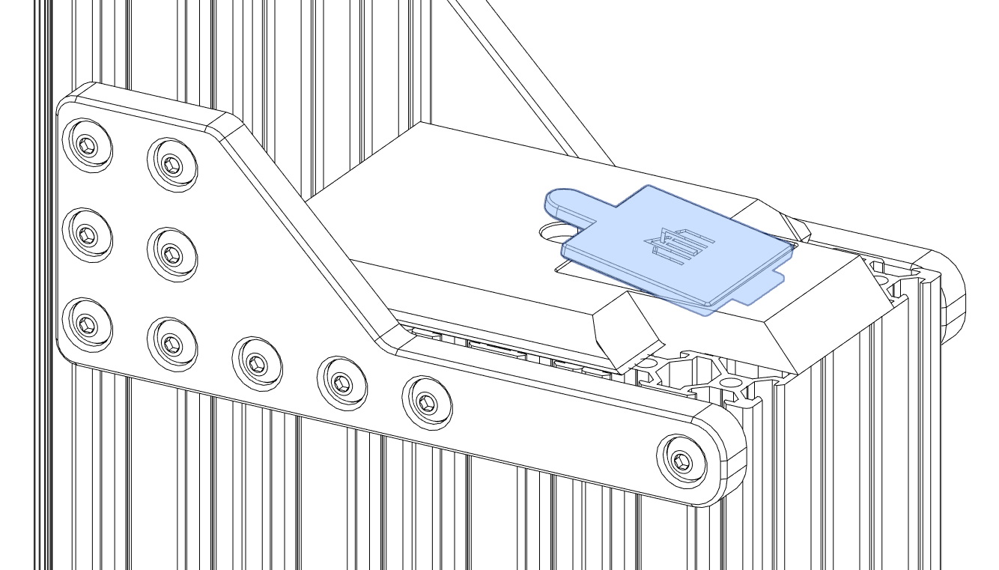

---

> M5 Heat Insert
> M3 Heat Insert

<!-- This image is reused from the y axis assembly on purpose -->

> M3x8mm SHCS
> Brass leadscrew nut

<!-- This image is reused from the y axis assembly on purpose -->
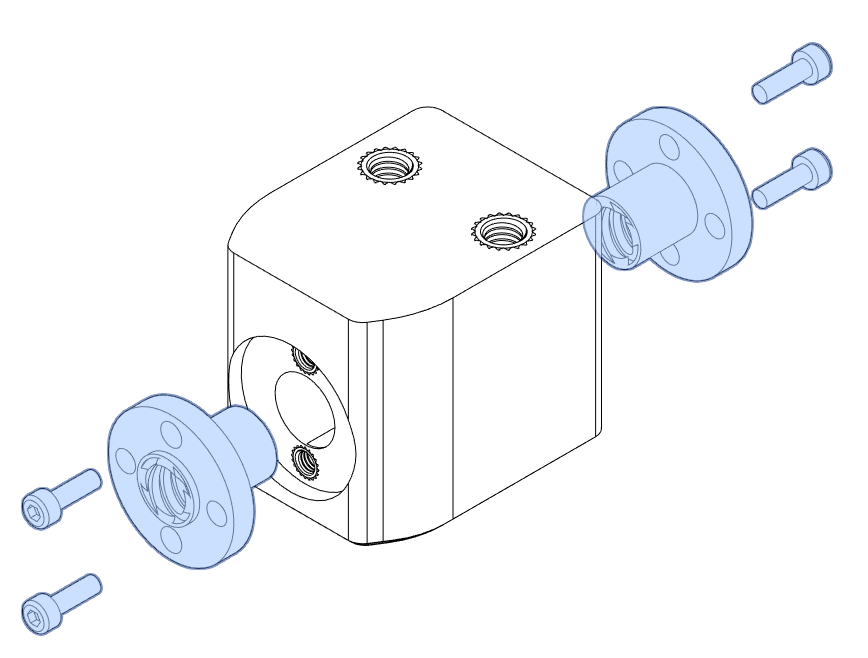

---

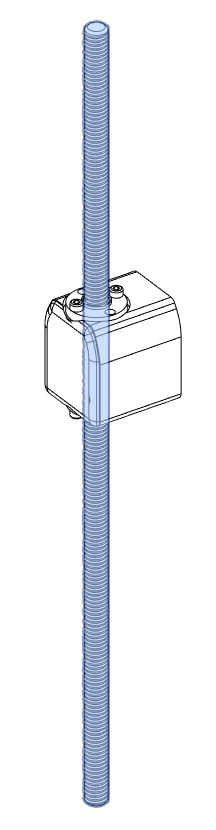

<!-- TODO do a composite showing the zoom -->
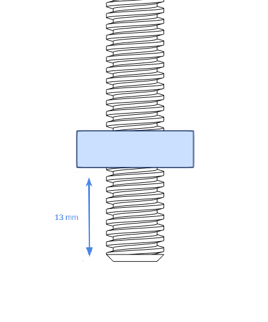

---

---

> M5x16mm BHCS

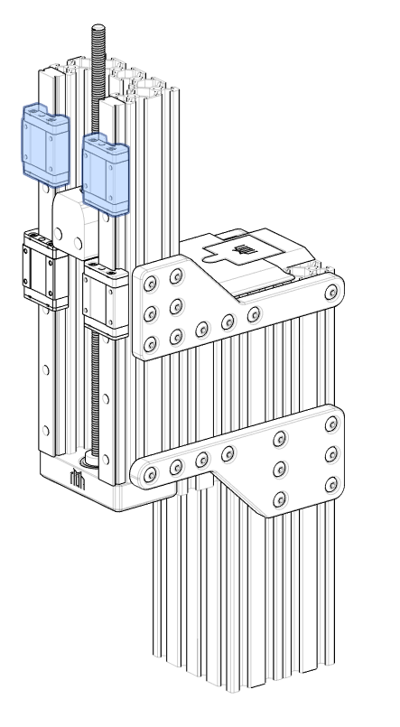

---

> M3x5mm SHCS

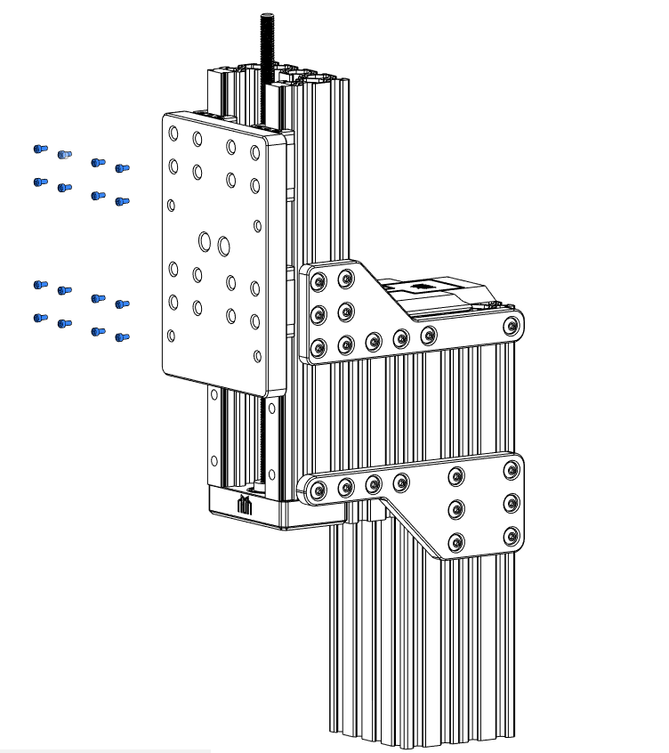

---

> 608ZZ bearing
> M2.5 Heat Insert

---

M5x12mm BHCS

---

## Install the motor at an angle

When installing the Z motor, attach your belt loosely around your leadscrew pulley and then slide your Z motor in at an angle.

---

## Belt tension

> M5 Nyloc Hex Nut
> M5 washer
> M5x20 SHCS

Before tightening the fasteners fully, make sure the tension is set correctly. To do this, pull the motor away from the column with one hand until the belt can be strummed like a guitar string and then tighten the fasteners in opposing corners first.

---

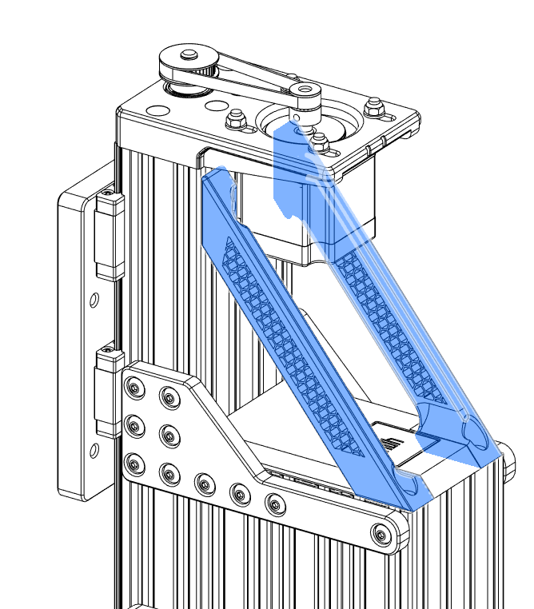

> M5x12mm BHCS

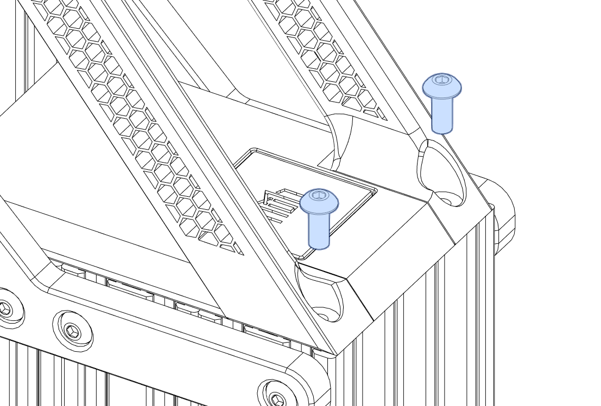

> M5x12mm BHCS

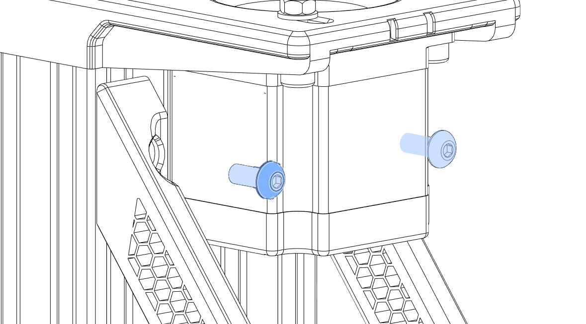

---

> M3 Heat Insert

> M5x12mm BHCS

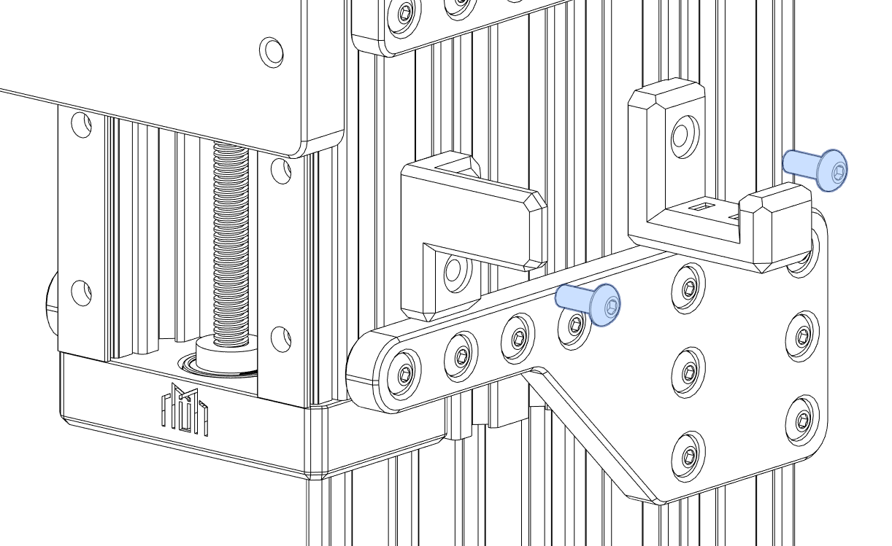

---

> M5x12mm BHCS

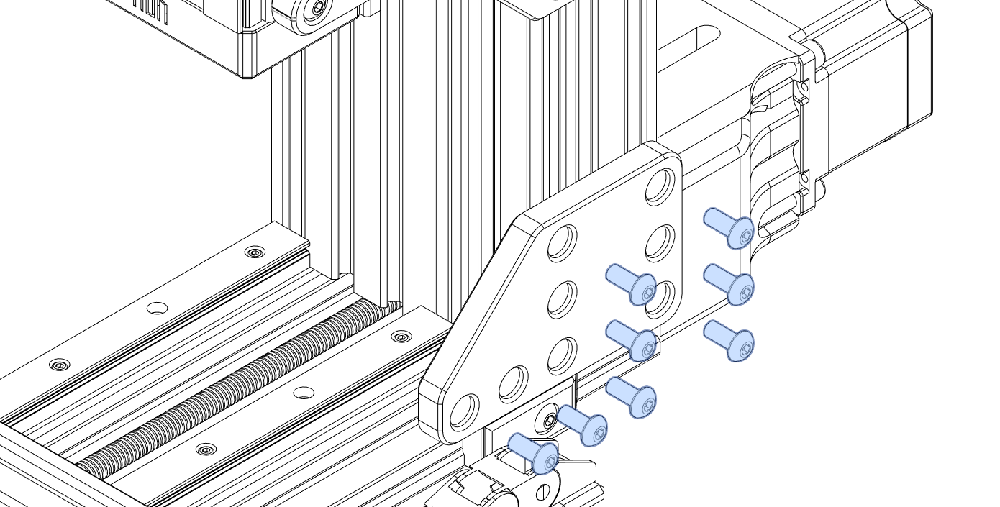

> M5x12mm BHCS

---

> M5 washer
> M5x100mm SHCS

---

> M3 Heat Insert

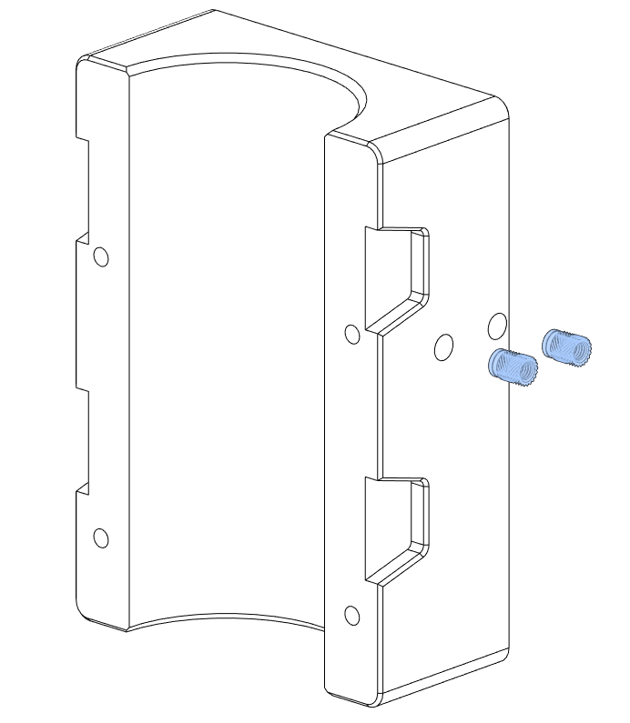

---

## Install spindle holder

It has come time to install your spindle mount - but do not install your spindle at this point.

---

## Do not tighten

Leave these M5 nuts loose for now.

> M5 washer
> M5 Nyloc Hex Nut

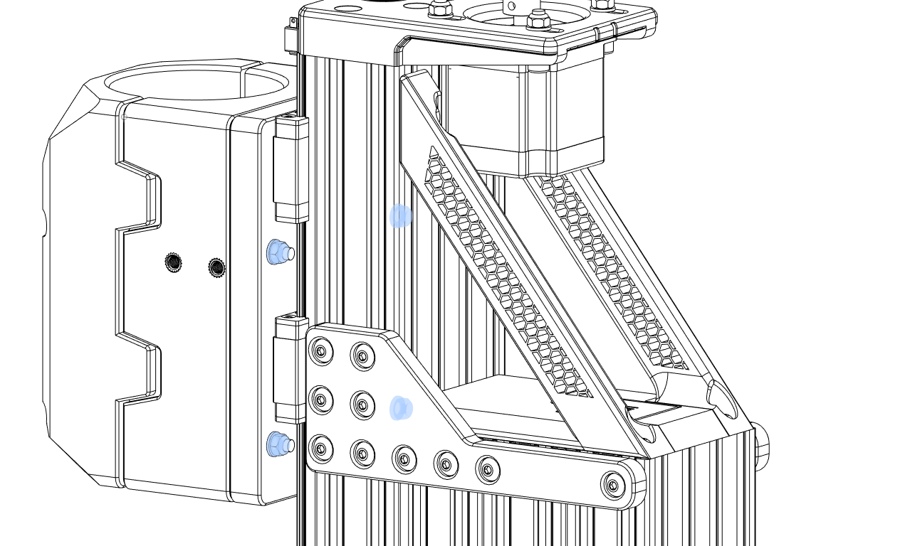

---

## Optional: Logo insert

If you wish at this point, you can glue in your Millennium Logo.

---

> M3 Heat Insert

> M5x12mm BHCS

---

> M3x6 FHCS

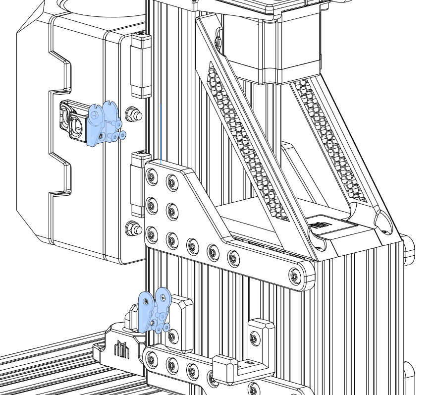

---

---

[Next Chapter: Table Assembly](./table_assembly.md)
