# Z Axis Assembly

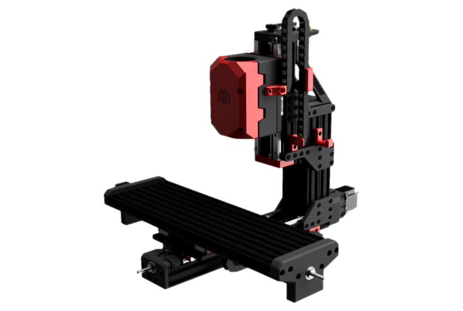

---

## Identifying extrusions

This section of the build contains a number of C-beams that are close together. To help you identify which parts are which, lay out your extrusions like the diagram shown below. The next steps will then highlight which extrusions are used for each step.

!!! info "Components Required"
    ```
    A: Openbuilds 4080x260mm C-Beam
    B: Openbuilds 4080x260mm C-Beam
    C: Openbuilds 4080x250mm C-Beam
    D: Openbuilds 4080x120mm C-Beam
    ```
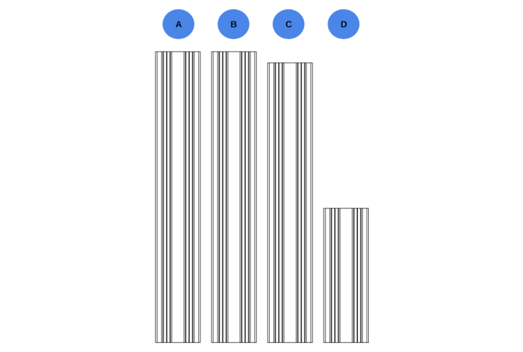{: .shadow}

---

Extrusions `A` and `B` are the main Z-column extrusions.

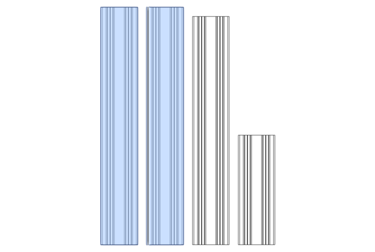{: .shadow}

---
## Installing the column plates

!!! info "Components Required"
    ```
    20 x M5x12mm BHCS
     1 x Joining Plate B
     1 x Joining Plate C
     1 x Joining Plate B Mirror
     1 x Joining Plate C Mirror
    ```

Place extrusions `A` and `B` facing each other, creating an internal channel. This is where the ballast box can be installed (later!).

Install Joining Plate B and Joining Plate C on one side, using M5x12 BHCS to hold the extrusions together.

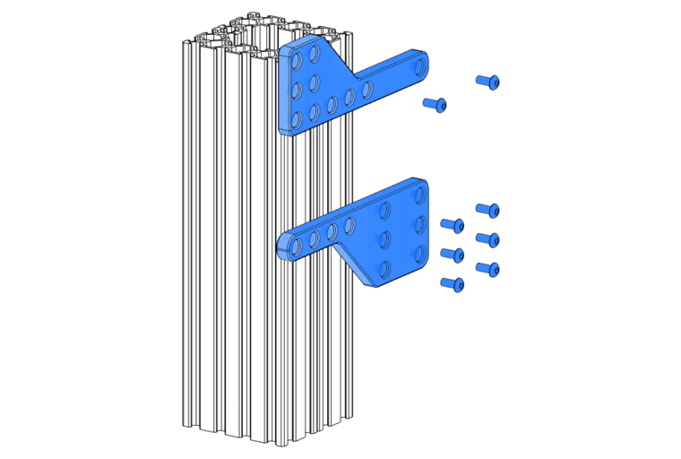{: .shadow}


!!! tip
    Make sure there is a `67mm` vertical spacing between the lower and upper column plates. The top of the thin part of the uppermost column plate should be flush with the top surface of the C-Beams.

---

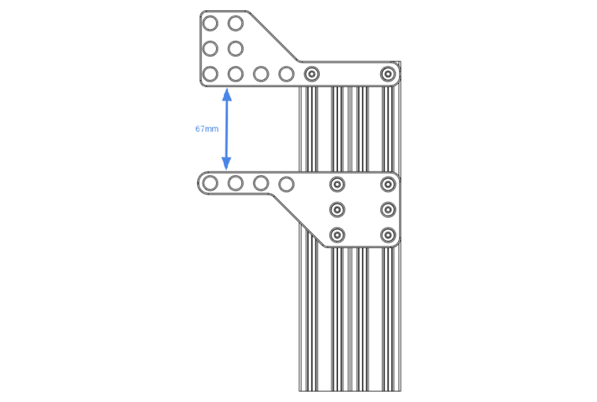{: .shadow}

---
Select extrusion `D`.

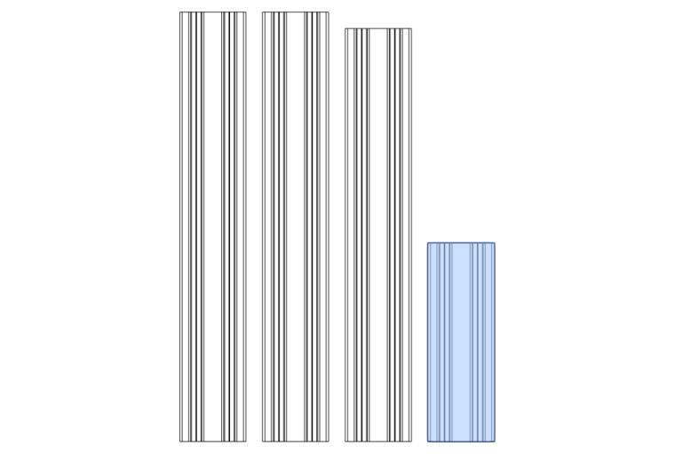{: .shadow}

---

Place  extrusion `D` at the top of the column with the channel facing _outwards_.

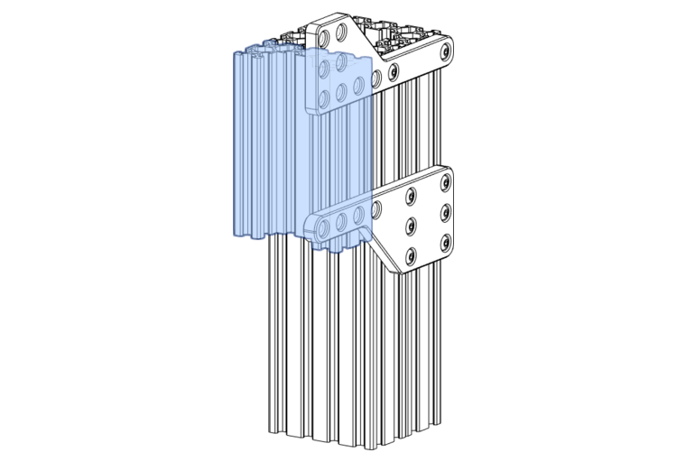{: .shadow}

---

Use M5x12 BHCS to hold the extrusion in place against the column.

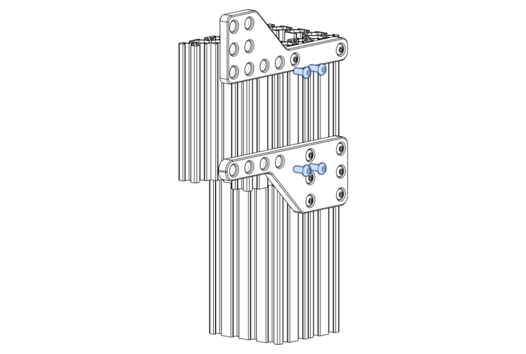{: .shadow}

---

Select extrusion `C`.

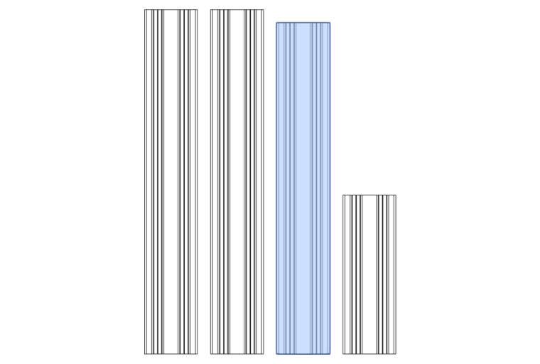{: .shadow}

---

Place it on the front of extrusion `D`, again with the channel facing _outwards_.

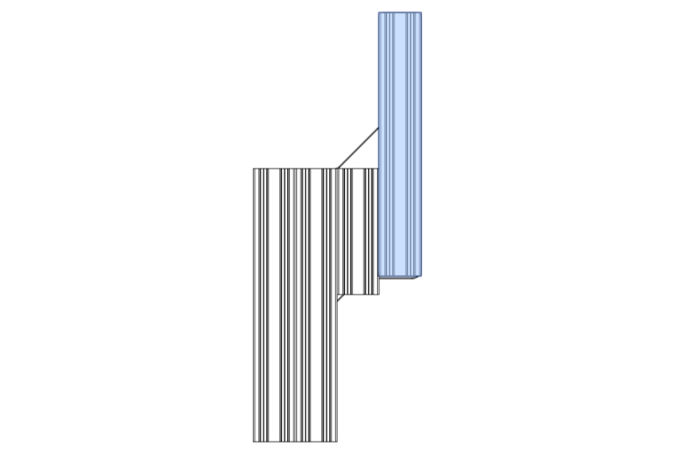{: .shadow}

!!! tip
    The lower edge of extrusion `C` should be `18mm` above the lower edge of extrusion `D`, making room for the lower bearing block.

---


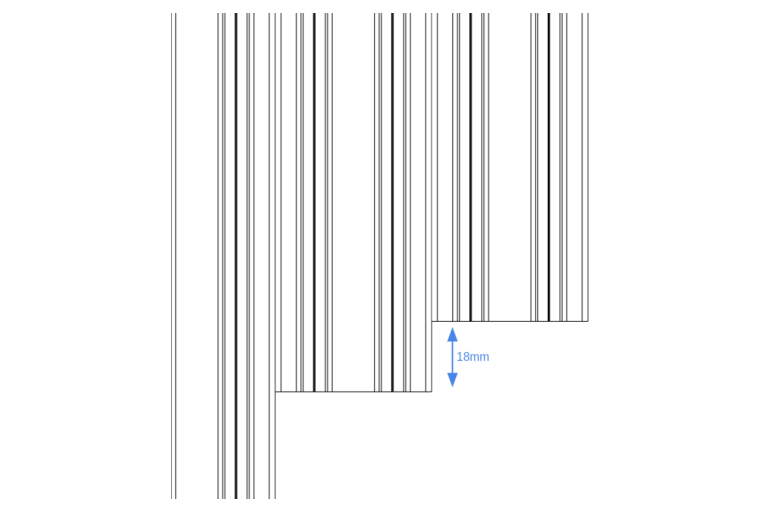{: .shadow}

---
<!-- TODO do a composite image showing the zoom in -->

Use M5x12 BHCS to hold the extrusion in place against the column.

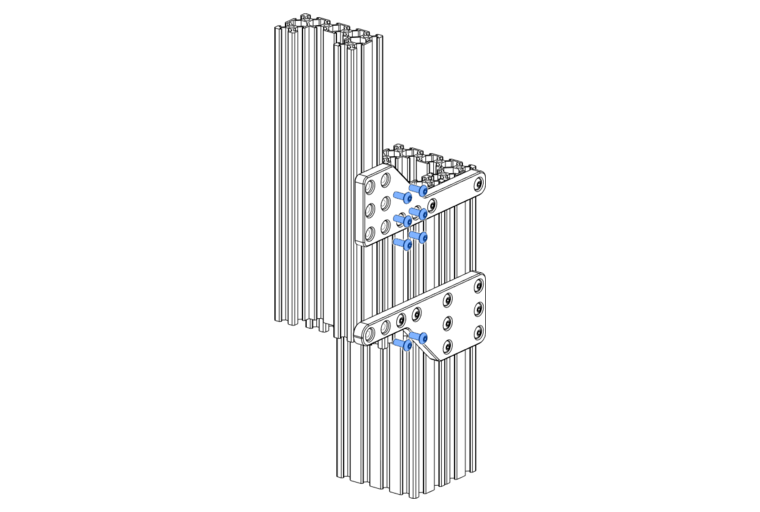{: .shadow}

At this point, you can install Joining Plate B Mirror and Joining Plate C Mirror on the other side of the column, taking care to align them with the plates on the other side.

---
## Lower Bearing Block

!!! info "Components Required"
    ```
    1 x 608ZZ bearing
    4 x M5x12mm BHCS
    ```

Push the 608ZZ bearing into the bearing block until it is flush.

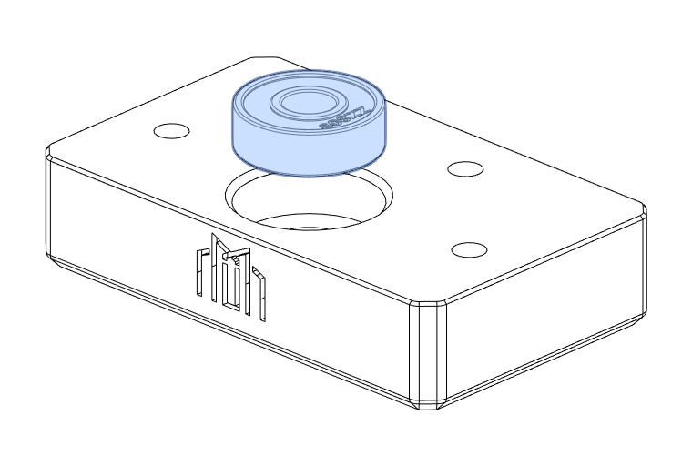{: .shadow}

---

Use M5x12mm BHCS to attach the bearing block to the bottom of extrusion `C`.

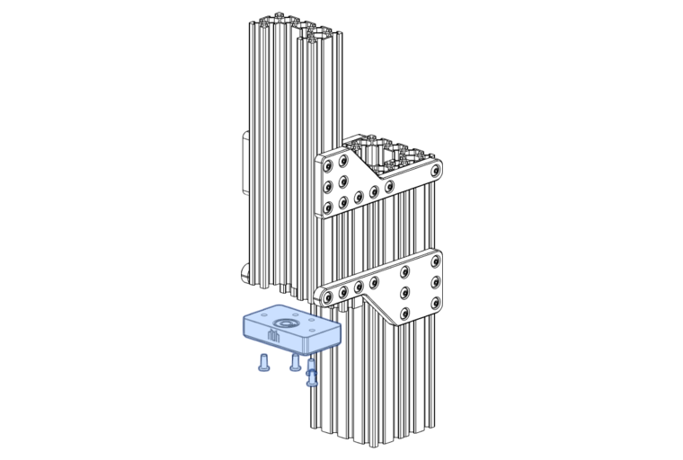{: .shadow}

---

## Ballast box

The ballast box is designed to house a damping load such as sand or epoxy granite. It is not a requirement but is recommended.

!!! info "Components Required"
    ```
    1 x Ballast Box
    1 x Ballast Cap
    ```
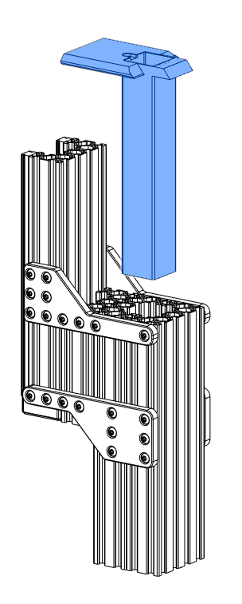{: .shadow}

!!! tip
    There is a small lip in the ballast box which registers with the tongue on the ballast cap.
    This is easiest to install at an angle.

!!! warning
    Once the ballast top is installed, it can be difficult to remove.
    Be sure that no other steps need to be taken before sealing the lid.

---

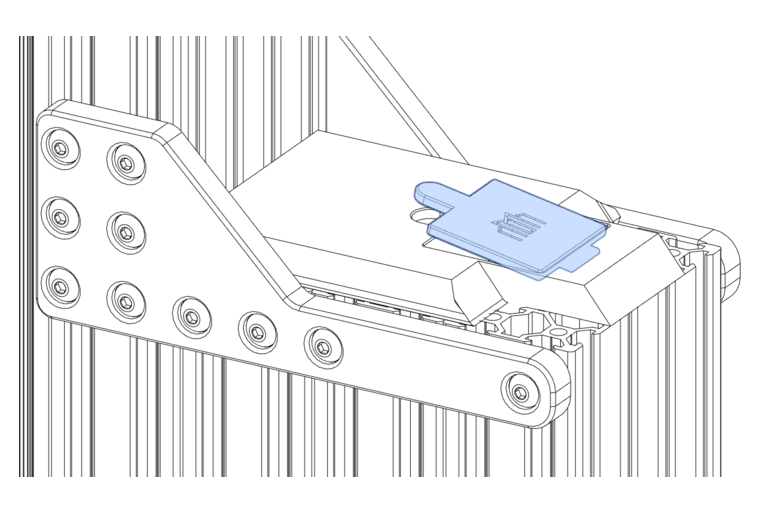{: .shadow}

---

## Z-Axis Anti-Backlash Nut

!!! info "Components Required"
    ```
    2 x M5 Heat-set Insert
    4 x M3 Heat-Set Insert
    4 x M3x8mm SHCS
    2 x Brass leadscrew nut
    ```

Insert the M3 and M5 heat-set inserts in the Z Axis Anti-Backlash Nut.
<!-- This image is reused from the y axis assembly on purpose -->
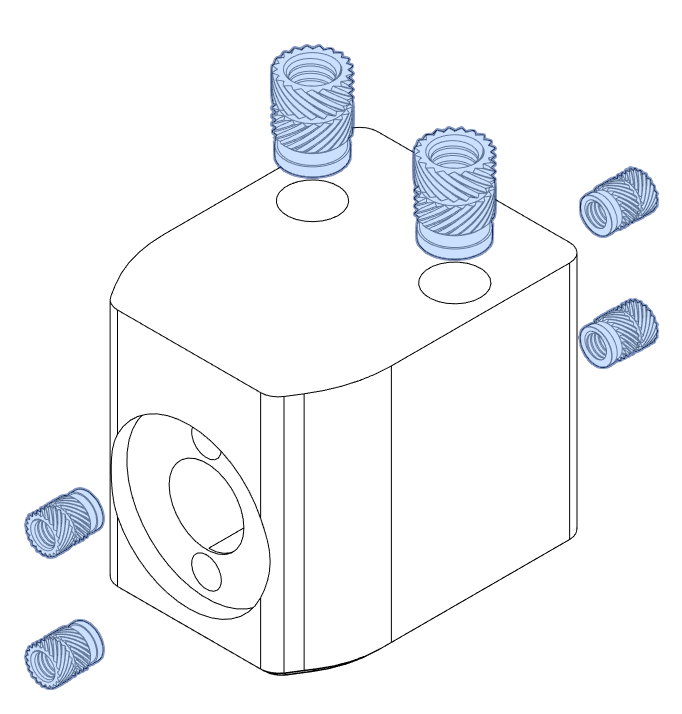{: .shadow}

---

Fasten the Brass leadscrew nuts on either side of the Z Axis Anti Backlash Nut using M3x8mm SHCS. Remember to apply medium-strength thread-lock!

<!-- This image is reused from the y axis assembly on purpose -->
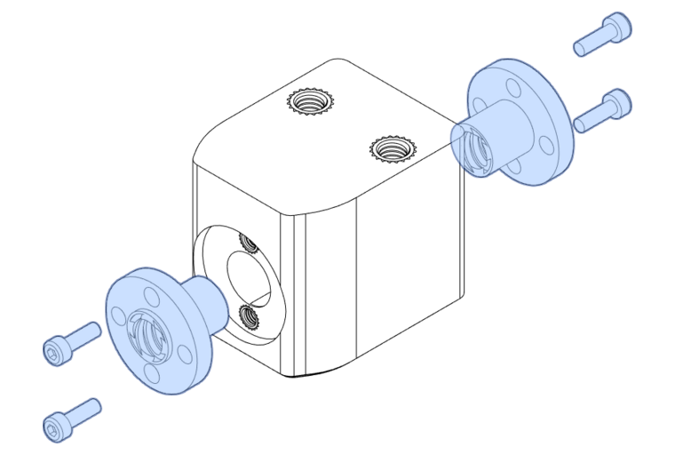{: .shadow}

---

Insert the lead-screw into the anti-backlash nut and set the preload using the same technique as the X and Y nuts.

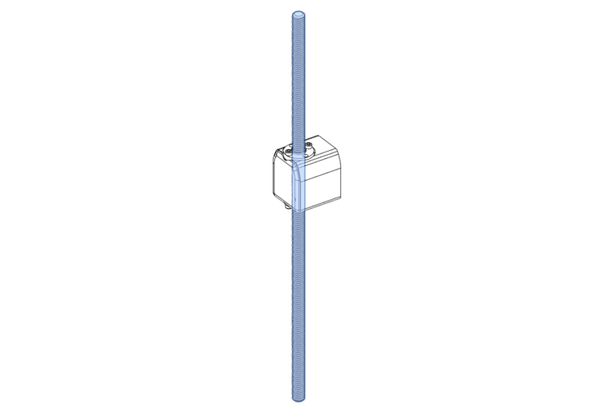{: .shadow}

---

Place a locking collar onto the bottom of the lead-screw, and lock it in place. Remember to apply medium-strength thread-lock to the grub screws!

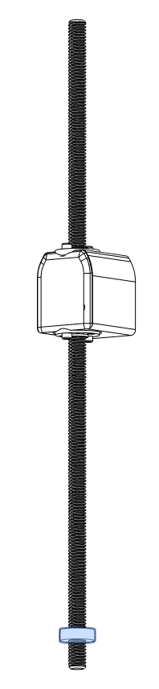{: .shadow}

!!! tip
    The locking collar should sit 13mm from the bottom of the lead-screw.

---
<!-- TODO do a composite showing the zoom -->
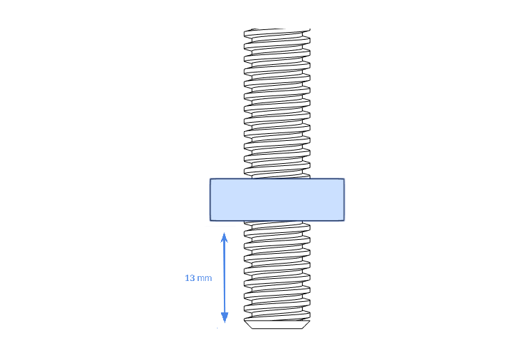{: .shadow}

---
## Z-Axis Rails and Lead Screw

Install the Z rails with only the lower carriages installed onto the frontmost extrusion.

Use printed [rail alignment guides](https://github.com/MilleniumMills/Millenium-Milo-v1.5/tree/main/STL%20Files/Tools/Rail%20Alignment%20Guide.stl) to make sure the rails are aligned.

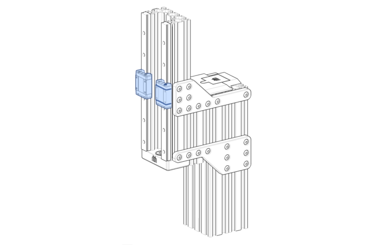{: .shadow}

!!! tip
    You can use the rail alignment guides to stop the lower carriages from falling off the vertical rail!

---

Place the lead-screw with the locking collar at the bottom into the bearing at the bottom of the Z-axis. The curved surface of the anti-backlash nut should face upwards.

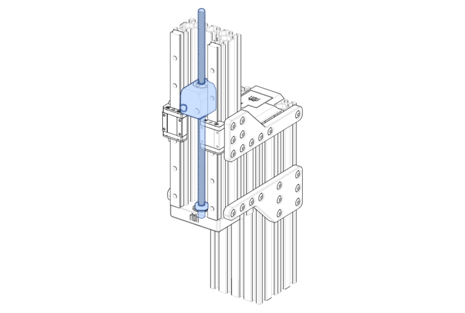{: .shadow}

---

Install the upper rail carriages onto the Z rails, above the anti-backlash nut.

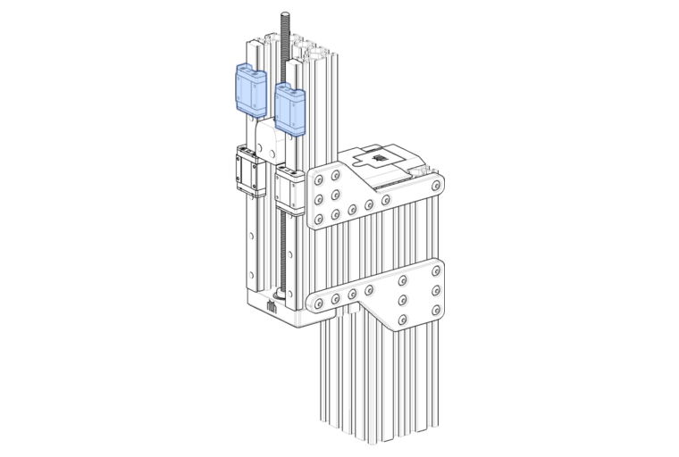{: .shadow}

---

## Z-Axis Mounting Plate and Motor Mount

!!! info "Components Required"
    ```
        16 x M3x5mm SHCS
         2 x M5x16mm BHCS
         2 x 608ZZ Bearing
         2 x M2.5 Heat-set Insert
         1 x Z-Axis Mounting Plate
         1 x Z-Axis Motor Mount
         1 x GT2 40T Pulley
    ```

Install the Z-Axis mounting plate onto the anti-backlash nut using M5x16mm BHCS.

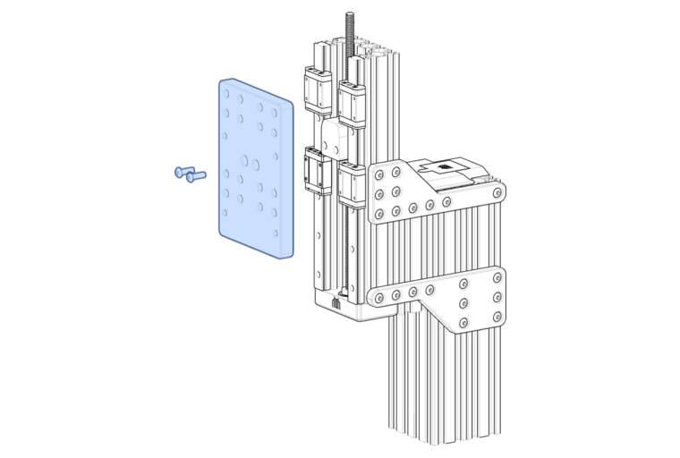{: .shadow}

---

Attach the Z-Axis mounting plate to the carriages using M3x5mm SHCS.

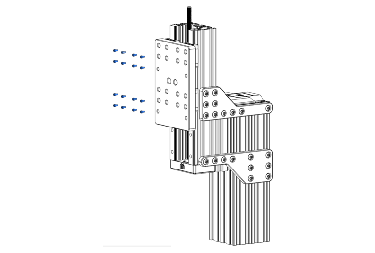{: .shadow}

---

Insert the 608ZZ bearings into the Z-Axis motor mount, and insert M2.5 heat-set inserts for the Z endstop.

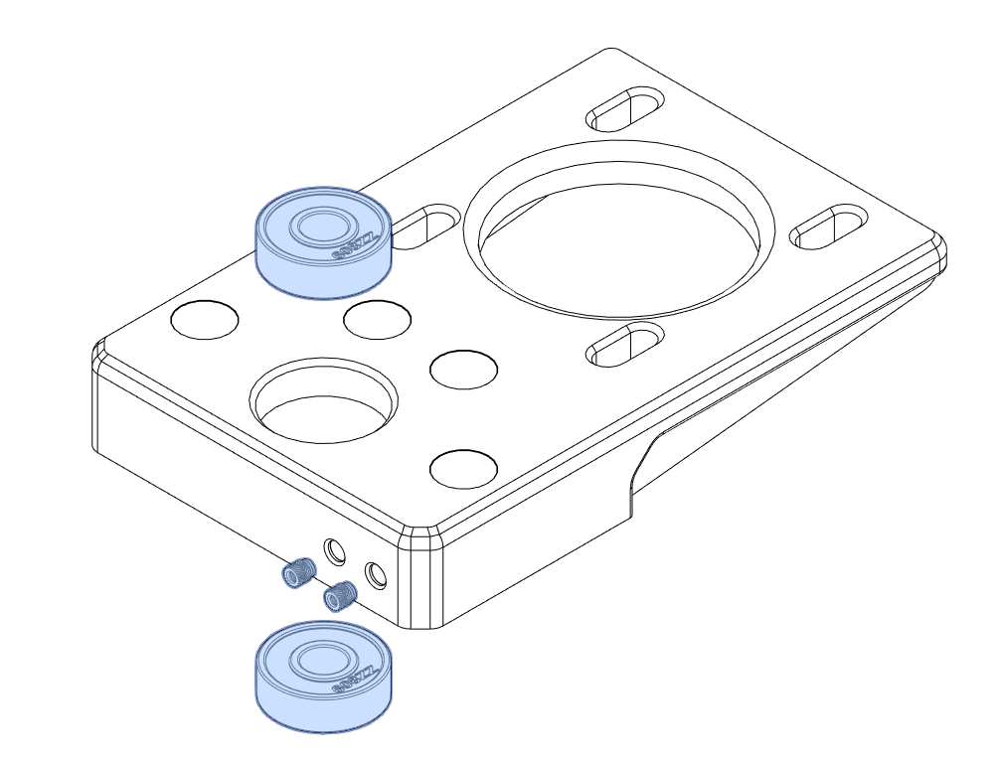{: .shadow}

---

Place a locking collar on the lead-screw.

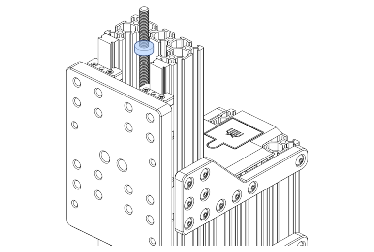{: .shadow}

!!! tip
    Tighten the collar slightly so that it stays in place. If you drop it at this point, it will be a pain to fish it out from behind the -Z-axis mounting plate!

---

Install the Z-Axis motor mount onto the top of the C-beam using M5x12mm BHCS.

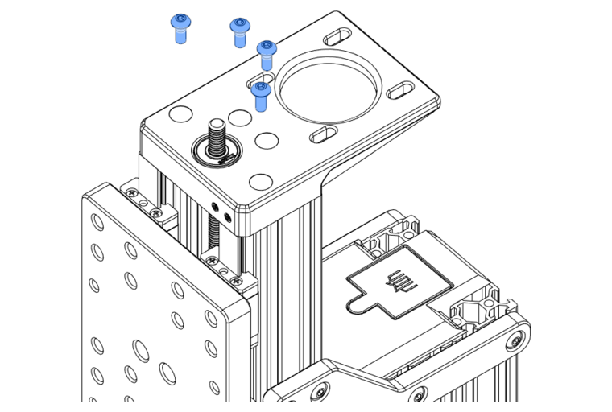{: .shadow}

---

Fasten the GT2 40T Pulley onto the top of the lead-screw.

With the Pulley attached above the bearings, you can now loosen off the locking collar below the bearings. Push it upwards until it contacts the lower bearing and lock it in place.

Remember to apply medium-strength thread-lock to all the grub screws!

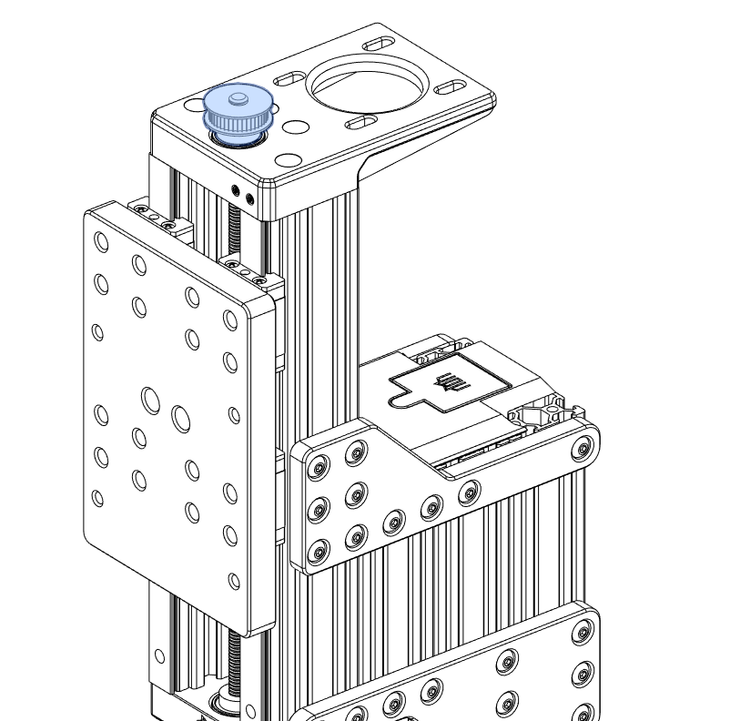{: .shadow}

---

## Z-Axis Motor

!!! info "Components Required"
    ```
    4 x M5x20mm BHCS
    4 x M5 Nyloc Nut
    4 x M5 Washer
    1 x GT2 20T Pulley
    1 x 200mm GT2 Belt
    ```
Fasten the GT2 20T Pulley onto the Z motor shaft.

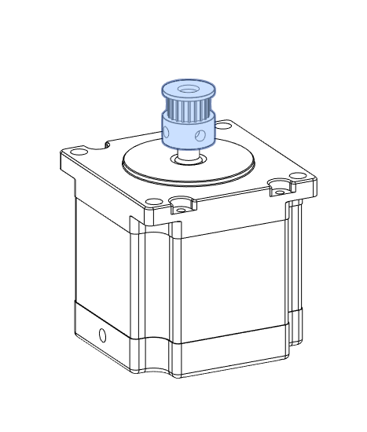{: .shadow}

---

When installing the Z motor, attach your belt loosely around your leadscrew pulley and then slide your Z motor in at an angle.

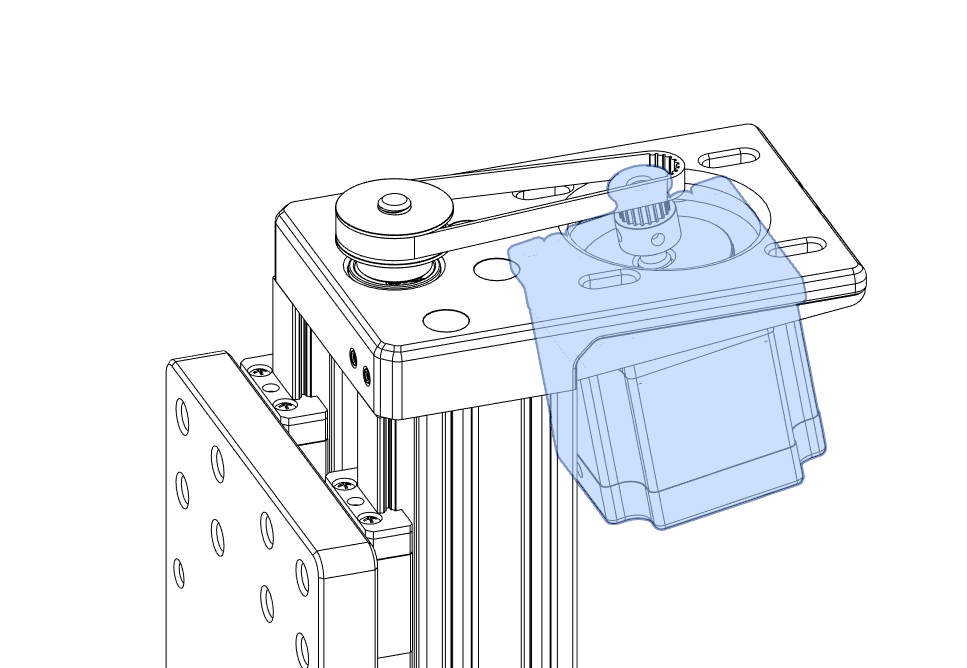{: .shadow}

---

Attach the motor using M5x20mm BHCS with M5 washers and Nyloc nuts on the upper surface of the Z motor mounting plate.

{: .shadow}

!!! info
    Before tightening the fasteners fully, make sure the tension is set correctly.
    To do this, pull the motor away from the column with one hand until the belt can be strummed like a guitar string and then tighten the fasteners in opposing corners first.

---
## Z Reinforcement Bracket

!!! info "Components Required"
    ```
    4 x M5x12mm BHCS
    2 x Z Reinforcement Bracket
    ```

Place the Z Reinforcement Brackets under the Z motor as shown below.

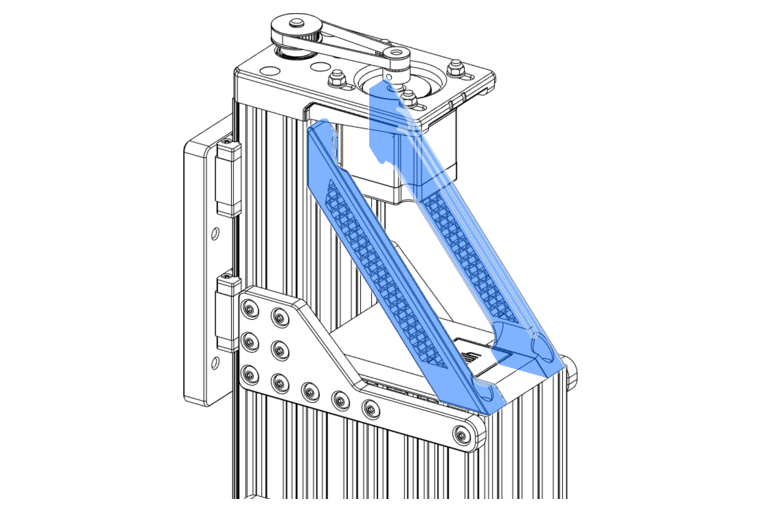{: .shadow}

---

Attach the reinforcement brackets at the bottom using M5x12mm BHCS.

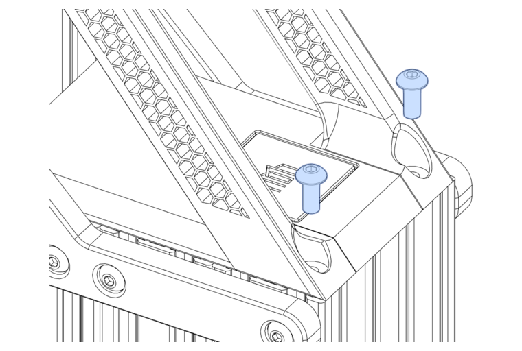{: .shadow}

---

And at the top using M5x12mm BHCS.

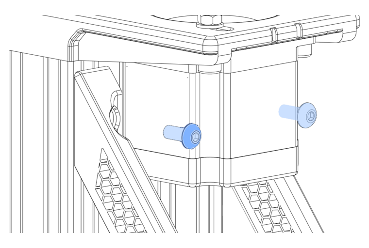{: .shadow}

---
## Cable Management
!!! info "Components Required"
    ```
    3 x M3 Heat-set Insert
    2 x M5x12mm BHCS
    1 x Z Drag-Chain Mount
    1 x Z Wire Redirect Hook
    ```

Install the M3 heat-set inserts into the Z Drag-Chain Mount.

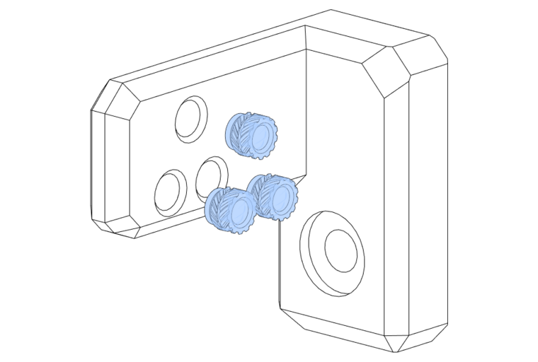{: .shadow}

---

Install the Z Drag-Chain mount and Wire Redirect Hook using M5x12mm BHCS.

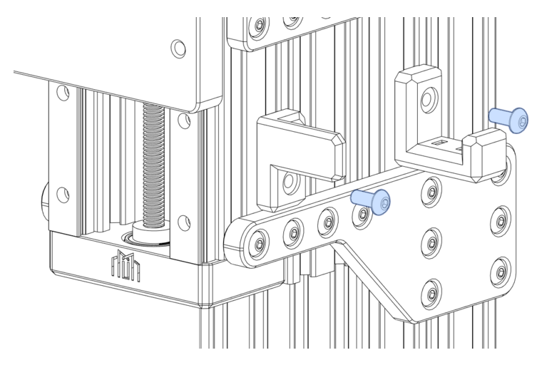{: .shadow}

---
## Joining Y and Z
!!! info "Components Required"
    ```
    18 x M5x12mm BHCS
     1 x Assembled Y Axis
     1 x Assembled Z Axis
     1 x Joining Plate A
     1 x Joining Plate A Mirror
    ```

Attach the assembled Y and Z axis to each other using M5x12mm BHCS through the joining plates.

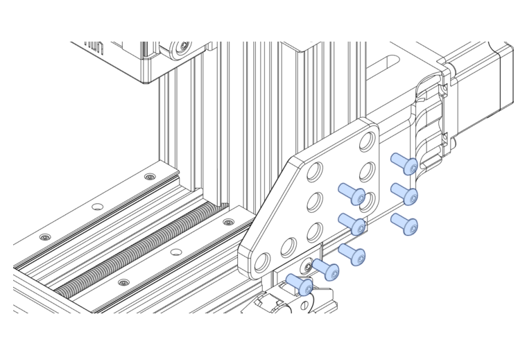{: .shadow}

---

Attach the Y motor mount to the Z axis using M5x12mm BHCS.

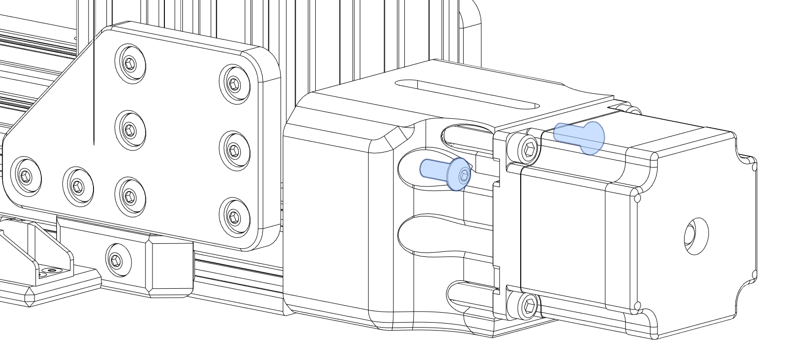{: .shadow}

---
## Spindle Mount

!!! info "Components Required"
    ```
     4 x M5x100mm BHCS
     4 x M5 Washer
     2 x M3 Heat-set Insert
     1 x Spindle Mount Part A
     1 x Spindle Mount Part B
    ```

Install M3 Heat-set inserts into Spindle Mount Part B.

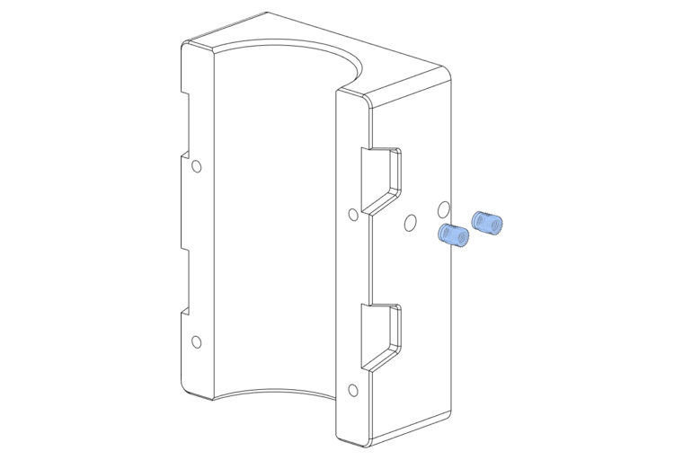{: .shadow}

---

Pass the M5x100mm BHCS through the M5 washers and into Spindle Mount Part A and B.

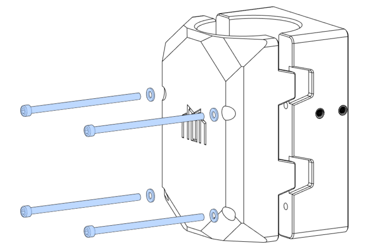{: .shadow}

---

## Install Spindle Mount

!!! info "Components Required"
    ```
     1 x Spindle Mount
     4 x M5 Nyloc Nuts
    ```

It has come time to install your spindle mount - but do not install your spindle at this point.

Bolt the M5x100mm BHCS through the Z-Axis Mounting Plate

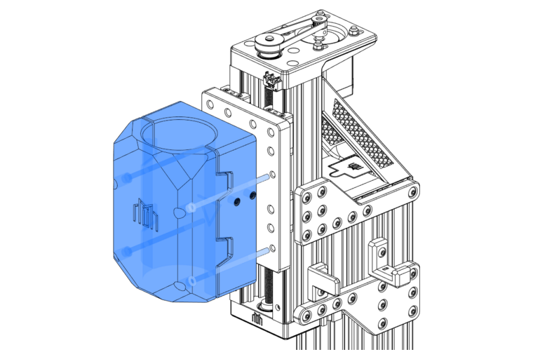{: .shadow}

---

Attach M5 Nyloc nuts on the back side.

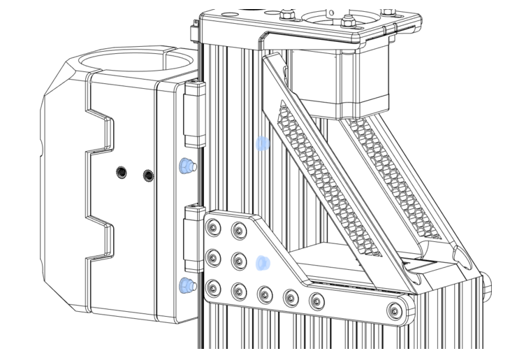{: .shadow}

!!! warning
    Do not tighten these nuts yet!

---

## Optional: Logo insert

!!! info "Components Required"
    ```
     1 x Millennium Machines Logo
     1 x Glue
    ```

If you wish at this point, you can glue in your Millennium Machines Logo.

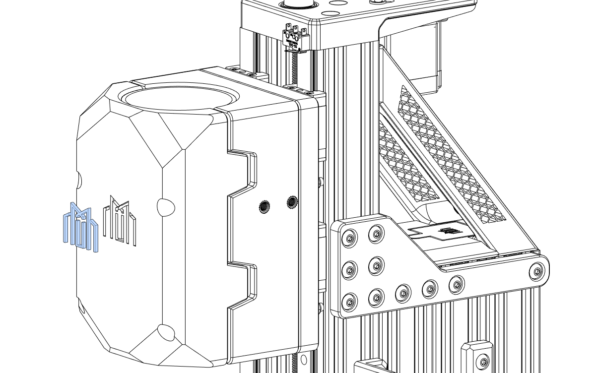{: .shadow}

---

## Cable Management... Continued
!!! info "Components Required"
    ```
     6 x M3x6 FHCS
     3 x M3 Heat-set Insert
     2 x M5x12 BHCS
     1 x Z Drag-Chain Mount B
     1 x Drag Chain
    ```

Install the M3 Heat-set inserts into the Z Drag-Chain Mount B.

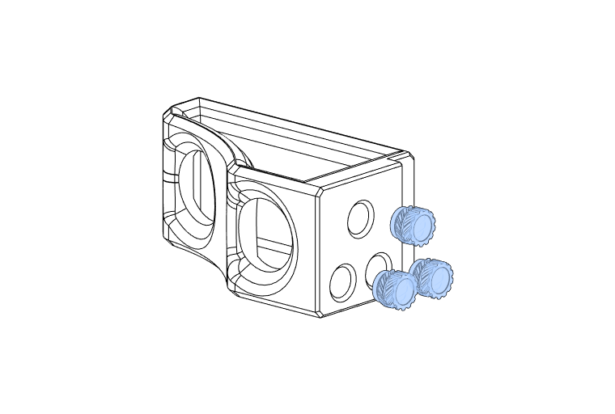{: .shadow}

---

Attach Z Drag-Chain Mount B to the Spindle Mount using M5x12mm BHCS.

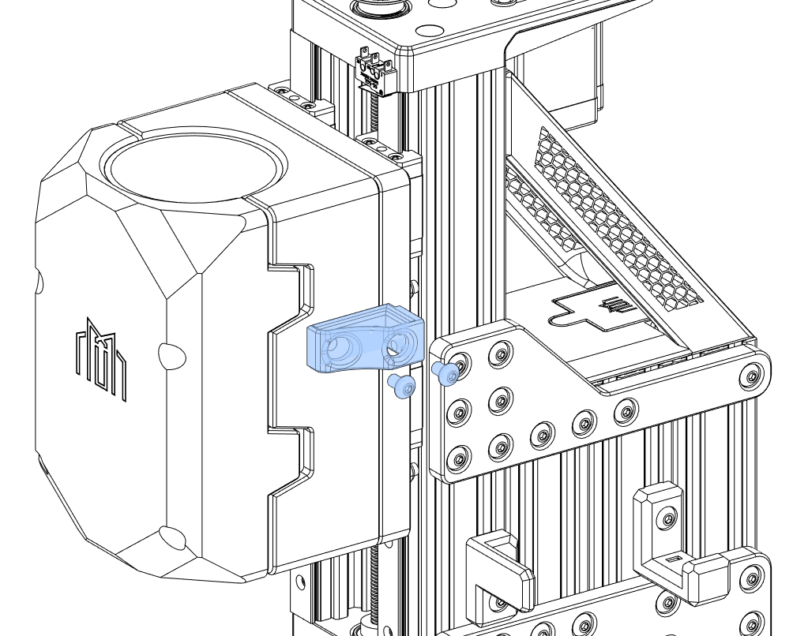{: .shadow}

---

Use M3x6 FHCS to attach the Drag Chain floating and fixed ends to the drag chain mounts.

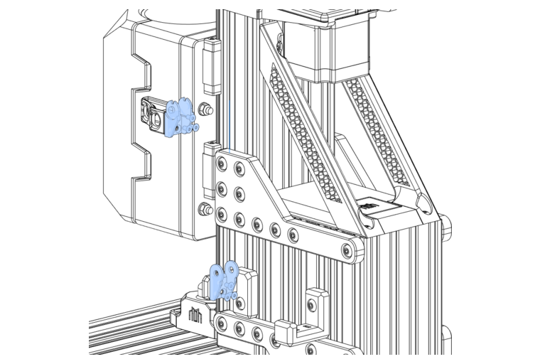{: .shadow}

---

Clip the drag chain body into place.

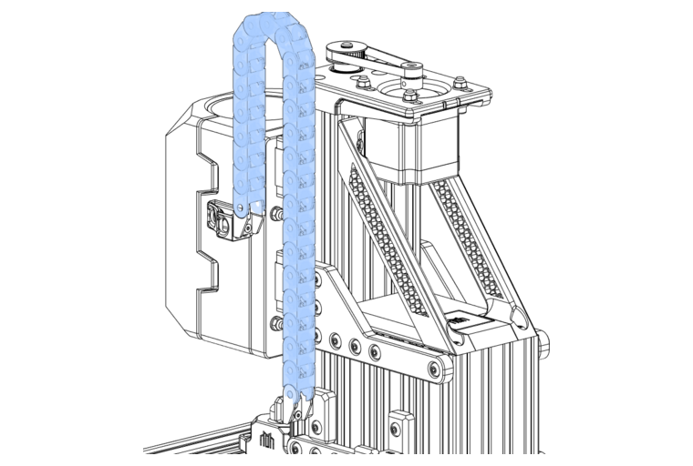{: .shadow}

---

[Next Chapter: Table Assembly](./table_assembly.md)
