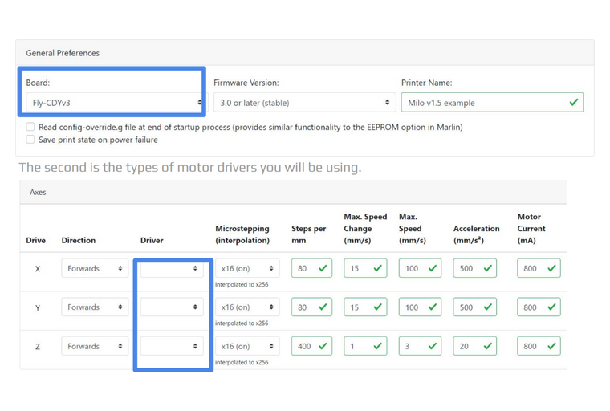
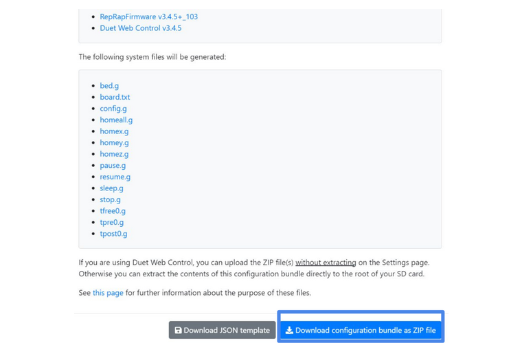
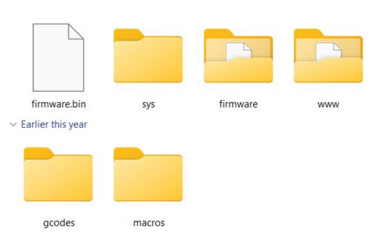
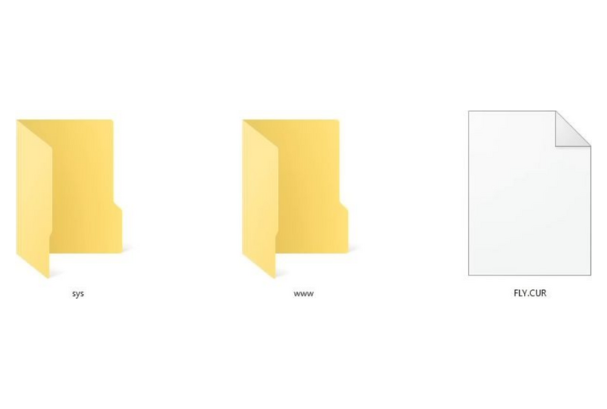
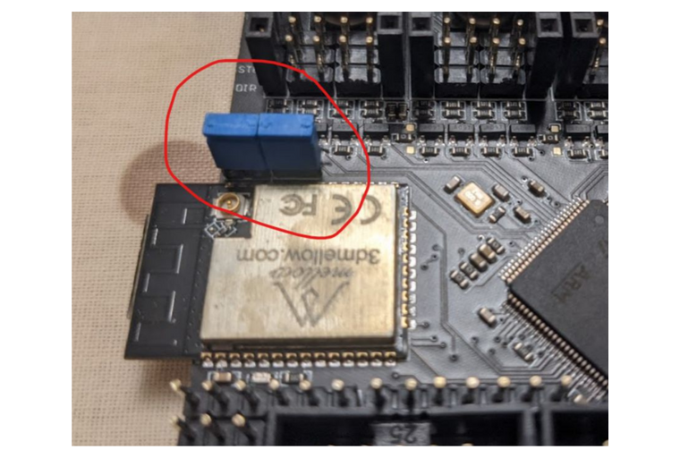
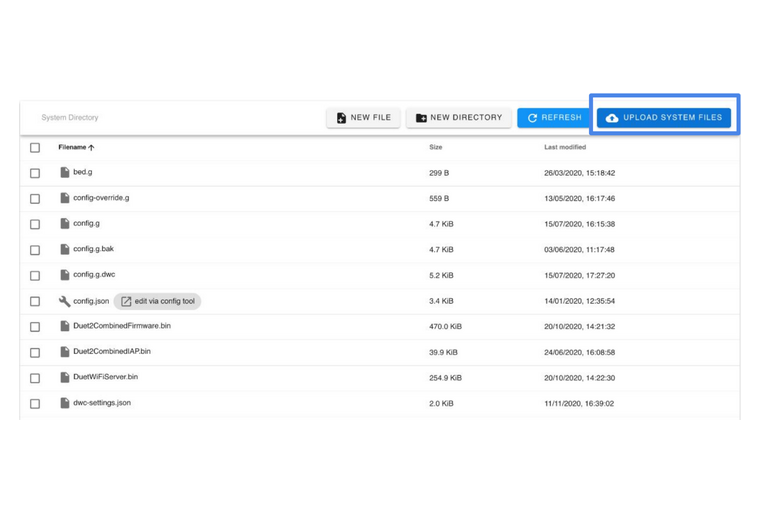

# Install RRF

!!! tip "Sit Back... and Relax!"
    For those of you who are less software inclined, don't panic! We've done most of the work for you.

    RRF requires you to populate an SD card with a specific file structure and files to go with it. To
    make this easier for you, we have gone ahead and populated the majority of these files already - all
    you need to do is follow the very simple steps below to get your firmware installed on your board.

    If you don't wish to install the premade firmware and would rather create your own from scratch, then
    please follow [this tutorial](https://www.youtube.com/watch?v=TAT532vIVzU&t=335s).

*[RRF]: RepRapFirmware

## Prepare your SD Card

You will need a freshly formatted SD card with a capacity of up to 32GB.

If the capacity of the card is 4GB or lower, use the FAT16 format - If the capacity is more than 4GB (up to 32GB) then you will have to use the FAT32 format.

The SD card should also be class 4 or higher.

---

## Copy and Paste

In the Milo v1.5 repository you will find a [Firmware Config](https://github.com/MillenniumMachines/Milo-v1.5/tree/main/Firmware%20and%20Post%20Processors/Example%20Firmware%20configs/Firmware%20V1.0) folder containing multiple other folders named with a number to denote the order of events and a descriptor to tell you what needs to be done with these files.

Starting with the file marked with `1.File structure`, copy and paste its contents onto your SD card (copy only the folder contents and not the folder itself).

---

## Create `/sys` Files

At this point we will have to use this [online tool](https://teamgloomy.github.io/Configurator) to configure your `/sys` folder files.

For the most part, the settings you choose won't affect anything as we'll be making changes later on down the line.

There are however, 2 crucial settings that need to be selected - the board (General tab) and motor drivers (Motors tab).

For a standard build, select the `Fly-CDYv3` option under the Board dropdown menu on the General tab.

For each of the X, Y and Z drivers on the standard build, select the `TMC2209` option under the Driver dropdown menu for each axis in the Motors tab.

{: .shadow}

---

Leave all other settings untouched and skip straight to the FINISH tab at the end of the configurator. Once you click finish a box will pop up with all your generated config files.

To continue, click "Download configuration bundle as ZIP file".

{: .shadow}

---

Once this file is finished downloading, unzip its contents and copy the "sys" folder inside straight onto your SD card.

---

## Check Your Work

Prior to starting your board for the first time, double check to make sure your SD card looks like the example seen here.

{: .shadow}

---

## Initial Flash

At this point, eject your SD card from your computer and mount it into your controller board.

Power your board either via USB or via your PSU and let the board work for a couple of minutes.

Turn the power off and put your SD card back into your computer. You will know this step worked if the `firmware.bin` file has changed into a `FLY.CUR` file as pictured below. Once confirmed, return your SD card to the board.

{: .shadow}

---

## Flash your WiFi Chip

If you are using the Mellow FLY CDY V3, then add 2 jumpers as shown below.

You may need to take similar or different steps depending on your board. You will need to refer to the documentation for your particular board to identify the steps required.

{: .shadow}

---

Once the jumpers are in place, power up the board using 12-24v and connect to the USB port on the board.

Connect to the board using a program such as `PuTTY`. Change the com port to match the `Fly-CDYv3` - baudrate doesn't matter.

Once connected type `M552 S0` (put WiFi chip into idle mode) into the terminal followed by `M997 S1` (flash WiFi chip) and wait for the wifi firmware to finish uploading.

You can use `M122` to check the status of the WiFi device, which is visible at the bottom of the command output.

!!!note
    If you’re struggling to get a readable output from `PUTTY`, follow this [link](https://teamgloomy.github.io/putty.html) to set it up to work with RRF.

---

## Set Up your WiFi

Whilst still in `PuTTY`, type `M552 S0` again,followed by `M587 S"your SSID" P"your password"`. Once this reports the details have been saved, finish off by typing `M552 S1` which will activate the WiFi.

Do not close `PuTTY` at this point. After some time it should return an IP address for example `192.168.x.xx``. Note this IP address down and then exit `PuTTY`.

---

## Upload Configuration Files
With your board still powered on, copy the IP address you noted in the last step into your web browser.

Once it loads you should now be face to face with the Duet Web Controller (DWC) interface.

In the left-hand menu navigate to the tab marked "System".

{: .shadow}

---

Once in the system tab click on “UPLOAD SYSTEM FILES” and upload all of the files found in ["2.Example Config"](https://github.com/MillenniumMachines/Milo-v1.5/tree/main/Firmware%20and%20Post%20Processors/Example%20Firmware%20configs/Firmware%20V1.0/2.%20Example%20config%20(upload%20contents%20to%20DWC)) to DWC.

{: .shadow}

---

At this point, the basic firmware setup is complete and all that remains are some firmware checks which will be covered later on in the manual.

!!! warning
    The firmware configuration available above is setup specifically for the `Fly-CDYv3`. You will need to modify this configuration if using a different mainboard. You may have to change endstop and spindle pin definitions at the very least.

It is now safe to perform the physical install of your board into your mainboard mount.

---

[Next Chapter: Assemble Electronics](./assemble_electronics.md)